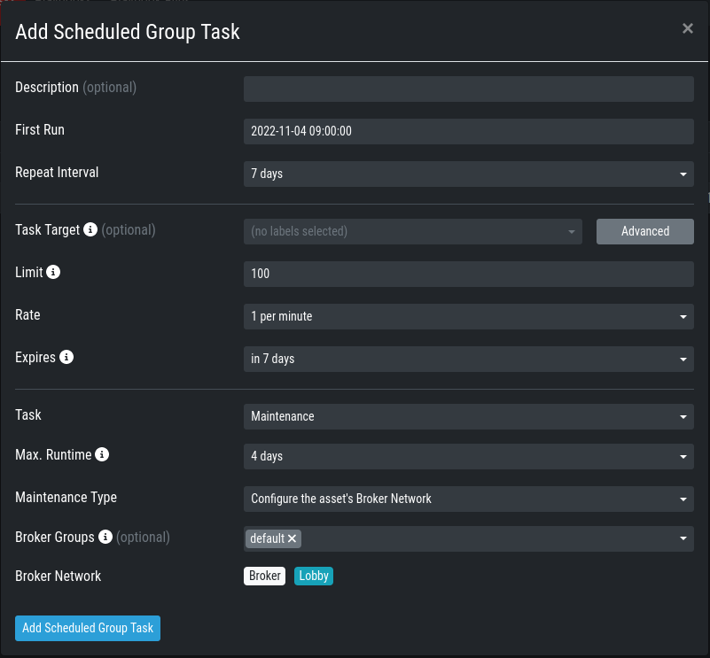

.. index:: ASGARD Agents

Agent Installer
---------------

After the Broker Network has been set up, you need to create a new Agent Installer.
To do this, navigate on your ASGARD to ``Downloads`` > ``Agent Installers``. From
here you can choose ``Add Agent Installers`` and set the configuration to your liking.
Most importantly here is the Option for ``Broker Groups``. Set this to the value which you
gave your Lobby and your Broker(s). After you added the agent installer, make sure to install it on the agents.

.. figure:: ../images/setup_agent_installer1.png
   :alt: New Agent Installer

.. figure:: ../images/setup_agent_installer2.png
   :alt: New Agent Installer

Migrate existing Agents to Broker Network
-----------------------------------------

If you need to update existing ASGARD Agents with your new configuration for the
Broker Network, you can create a (Scheduled) Group Task.

To do this, navigate to ``Response Control`` > ``(Scheduled) Group Task`` and
add a new task. Chose ``Maintenance`` for the Task and ``Configure the asset's Broker Network`` for the Maintenance Type.

The Broker Groups are optional, but you should choose accordingly if you created a different group in the earlier steps.

Once the Agents received the task from your ASGARD, the configuration will be updated.
The Agent will register itself to your Lobby and ask for a certificate. This certificate
is used to allow communication with the Broker.