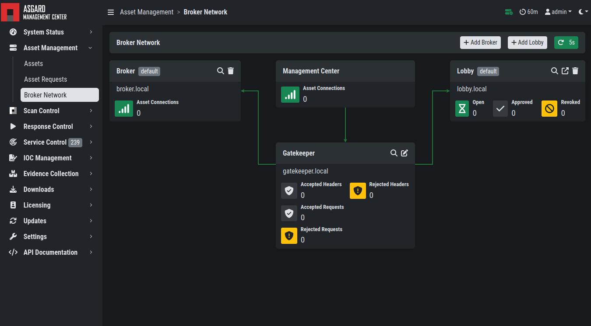
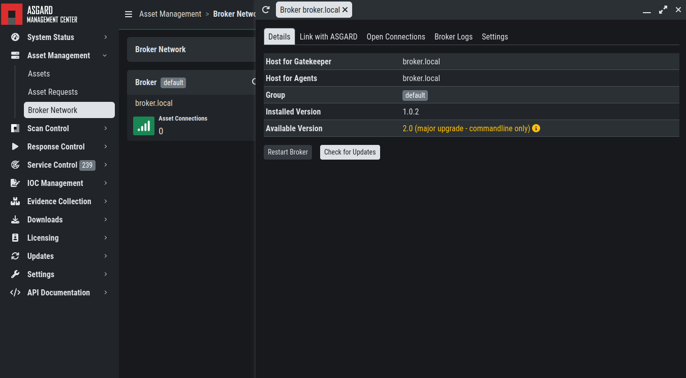
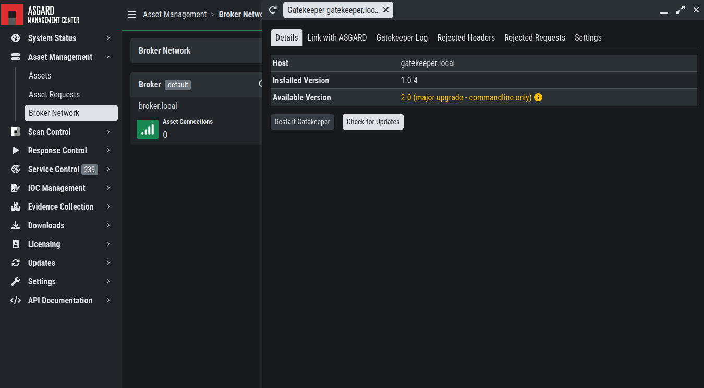
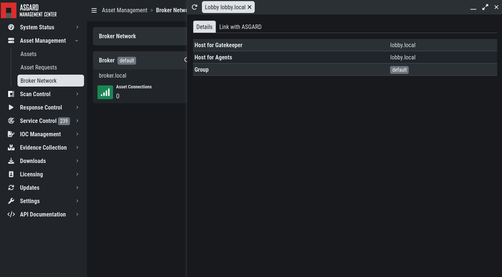

.. index:: ASGARD

Broker Network in the ASGARD Management Center
----------------------------------------------

The Broker Network view in your ASGARD gives you:

- The number of Asset connections
- Gatekeeper Statistics
- Open, Approved and Revoked Asset Requests in your Lobby
- Indicator of connection issues between your components

Additionally, you can configure some settings of your Brokers, Gatekeeper and Lobby.

Broker Maintenance
~~~~~~~~~~~~~~~~~~

In your Broker Network view, you can configure and inspect the status of your Brokers:

- Restart Broker
- Check for updates
- Statistics regarding Open Connections
- Broker Logs
- Settings

   - Configure syslog
   - Configure NTP 

Gatekeeper Maintenance
~~~~~~~~~~~~~~~~~~~~~~

In your Broker Network view, you can configure and inspect the status of your Gatekeeper:

- Restart Broker
- Check for updates
- Statistics regarding Open Connections
- Gatekeeper Log
- Rejected Headers
- Rejected Requests
- Settings

   - Configure syslog
   - Configure NTP 

Lobby Maintenance
~~~~~~~~~~~~~~~~~

In your Broker Network view, you can inspect the details of your Lobby:

For configuration and Maintenance, use the Web Interface of the Lobby running on port ``9443``,
see chapter :ref:`administration/lobby_usage:using the lobby`.