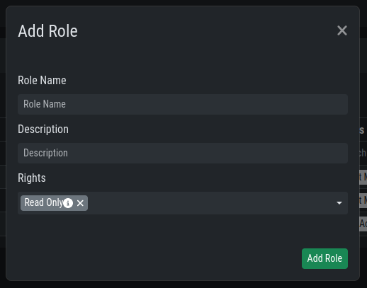
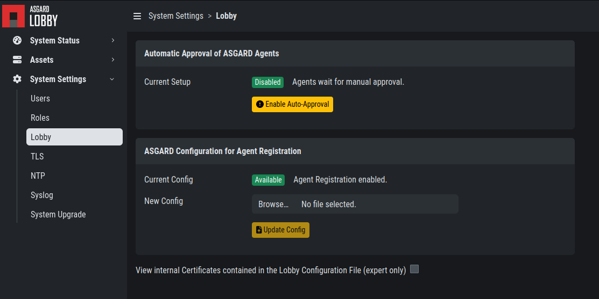
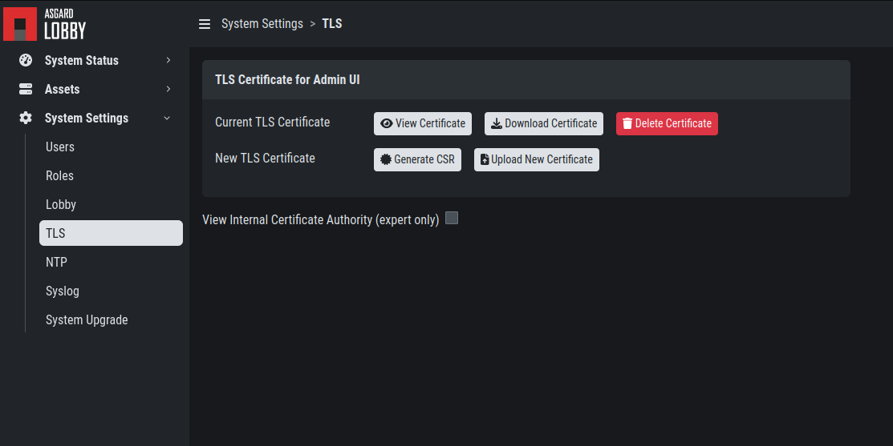
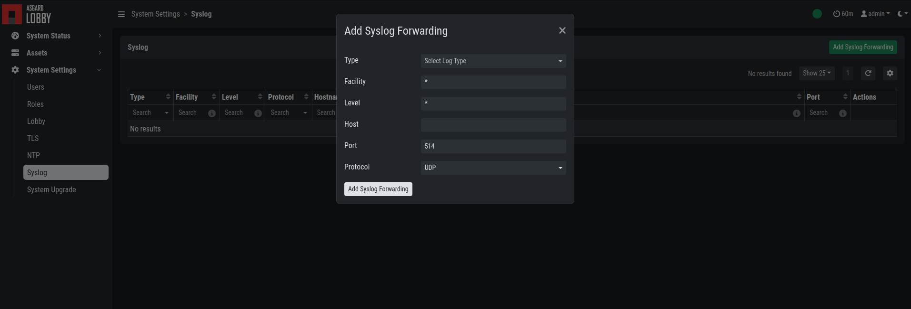
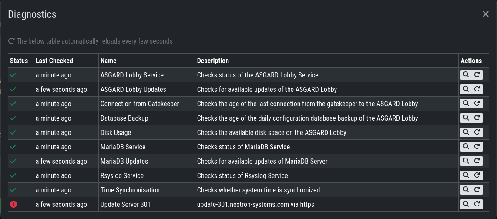
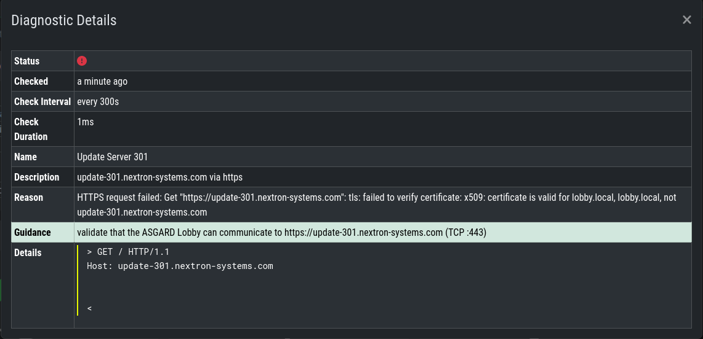

.. index:: Lobby Settings

Lobby Settings
~~~~~~~~~~~~~~

The Settings in your Lobby allow you to configure and tweak certain settings:

- Users
- Roles
- Lobby
- TLS
- NTP
- Syslog
- System Upgrade

Lobby Settings - Users
^^^^^^^^^^^^^^^^^^^^^^

In the Users setting of the Lobby you can create new users or assign roles to existing users.

You can also enforce the usage of 2FA for certain users.

Lobby Settings - Roles
^^^^^^^^^^^^^^^^^^^^^^

You can define different roles for your Lobby. The default roles are:

- User Admin
- Asset Manager
- Admin

An Additional Role of ``Read-Only`` can be created.

Lobby Settings - Lobby
^^^^^^^^^^^^^^^^^^^^^^

In the Lobby Settings, you can see if Current Config is Available, which in
return allows Agent Registration. This does not need to be changed, only during
the initial setup you need to import the configuration.

Additionally, you can enable the ``Automatic Approval of ASGARD Agents``

Lobby Settings - TLS
^^^^^^^^^^^^^^^^^^^^

You can upload a TLS Certificate for the Web Interface of the Lobby.

Lobby Settings - NTP
^^^^^^^^^^^^^^^^^^^^

You can change the NTP Settings of the Lobby here. An indicator is shown with
additional details regarding the NTP Status.

.. figure:: ../images/lobby_settings_ntp.png
   :alt: The NTP Settings

Lobby Settings - Syslog
^^^^^^^^^^^^^^^^^^^^^^^

You can configure Syslog Forwarding here, similar to the settings in your
ASGARD, but only for your Lobby Logs.

Lobby Settings - Upgrade
^^^^^^^^^^^^^^^^^^^^^^^^

Here you can apply system upgrades for the lobby. Additional information regarding
the system are shown as well. You can also see and download the upgrade log if necessary.

.. figure:: ../images/lobby_settings_upgrade.png
   :alt: The Syslog Settings

Lobby Status
~~~~~~~~~~~~

The Lobby Status on the left hand side of the navigation menu gives a good
indicator if there are any issues with the system.

Lobby Status - OK
^^^^^^^^^^^^^^^^^

The green indicator means that everything is working as expected.

.. figure:: ../images/lobby_status_navigation_ok.png
   :alt: Lobby Status - OK

Lobby Status - Warning
^^^^^^^^^^^^^^^^^^^^^^

A yellow indicator means that one or more services are not running properly.

.. figure:: ../images/lobby_status_navigation_warn.png
   :alt: Lobby Status - Warning

Inspect the Diagnostics panel by clicking on the ``ASGARD Lobby Status``
button to get a better understanding of the issue.

.. figure:: ../images/lobby_diagnostics_panel_warn.png
   :alt: Lobby Diagnostics - Warning

Here we can see that the Gatekeeper didn't contact the Lobby. You can see more
details by clicking the magnifying glass to the right.

.. figure:: ../images/lobby_diagnostics_details_panel_warn.png
   :alt: Lobby Diagnostics - Warning

Lobby Status - Error
^^^^^^^^^^^^^^^^^^^^

A red indicator means that one or more services are problematic and need to be fixed in a timely manner.

.. figure:: ../images/lobby_status_navigation_error.png
   :alt: Lobby Status - Error

Inspect the Diagnostics panel by clicking on the ``ASGARD Lobby Status`` button to get a better understanding of the issue.

Here we can see that the Lobby can't reach the update server. You can see more details by clicking the magnifying glass to the right.

