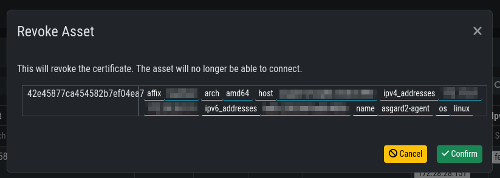
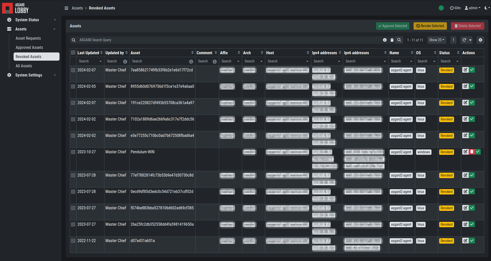

.. index:: Lobby Usage

Using the Lobby
---------------

The Lobby is the component in your Broker Network which needs a little more attention.
The Lobby is distributing or revoking certificates for ASGARD Agents, which are needed
to communicate over the secure channel of the Broker Network.
The first thing your Agents, if configured to use your Broker Network, will do,
is to contact your Lobby. They need a unique certificate to be able to communicate with your Brokers.

During the initial setup of your Agent, a unique public and private key will be generated.
The agent sends the public key to the Lobby, which in return (if the Asset is being accepted)
sends the agent a signed TLS ClientAuth certificate.

The Gatekeeper is pulling the current CA certificate from the Lobby,
as well as the CRL and sends it to all the Brokers. The Brokers need this
CA certificate to verify the authenticity of the presented certificate (similar to TLS in Web traffic).

The agent will use the earlier issued certificate from the Lobby to communicate
with the Broker. If the certificate is valid (i.e. it was signed by the root CA in the Lobby),
it is allowed to continue further. If the certificate of the agent has been revoked (now in the CRL)
or was not signed by the CA, communication is denied.

Asset Requests
~~~~~~~~~~~~~~

In your Lobby you can see the Asset Request of your Agents in ``Assets`` > ``Asset Requests``:

.. figure:: ../images/lobby_asset_request.png
   :alt: Asset Request in the Lobby

Here you have four options depending on what should happen to this agent:

- Issue Certificate to allow connections from an asset
- Revoke Certificate to deny connections from an asset 
- Delete Asset from Database; the asset may re-register
- Edit Asset

You can set your Lobby to auto-accept new agents, see :ref:`administration/lobby_settings:Lobby Settings`.

Approved Assets
~~~~~~~~~~~~~~~

In your Lobby you can see all the approved assets in ``Assets`` > ``Approved Assets``.

.. figure:: ../images/lobby_approved_assets.png
   :alt: Approved Assets in the Lobby

Here you can see more information about the issued certificates or revoke some certificates to deny connection from the assets.

Actions you can take:

- Revoke Certificate to deny connections from an asset
- Edit Asset

Once a certificate is revoked, the Agent communication is denied. The certificate
will be placed in the CRL, which in return gets distributed by the Gatekeeper to all the Brokers.

Revoked Assets
~~~~~~~~~~~~~~

In your Lobby you can see all the revoked assets in ``Assets`` > ``Revoked Assets``.

Actions you can take here:

- Issue Certificate to allow connections from an asset
- Edit Asset

If you want to allow a revoked asset to communicate with the Brokers again,
you can do this here. The certificate belonging to the asset will be removed from the CRL,
which in return gets distributed by the Gatekeeper to all the Brokers.

From this point on, the Agent can communicate with the ASGARD through the Broker again.
Revoking and Allowing certificates will reflect to the Brokers rather quickly.