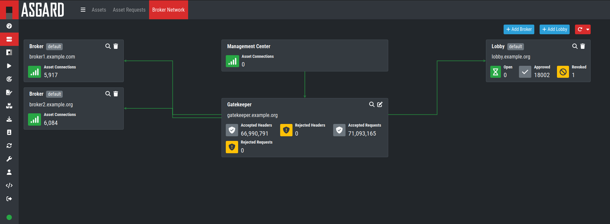

.. index:: General Understanding

Before You Begin
================

Agent to Management Center Communication
----------------------------------------

There are a few things to consider before you start with the installation of you Broker Network.
The communication between the Endpoint agent and the Broker Network is unidirectional.
The Endpoint agent establishes a connection to the Management Center, or one of the Brokers if
configured, and looks for tasks to execute.

The Broker Network acts as a gateway between Endpoint Agents and the Management Center itself.
This allows for more flexibility within your environment, such as remote agents which are not 
using a VPN, or a dedicated Broker in your DMZ.

Overview of the Components
^^^^^^^^^^^^^^^^^^^^^^^^^^

There are three components which are needed for the Broker Network:

   * **Lobby** - New Endpoint Agents will get a certificate for a secure communication
     from the Lobby. An administrator can accept the agents or configure the auto-accept
     option. Certificates for agents can also be revoked here.
   * **Gatekeeper** - The Gatekeeper is used to communicate directly between all the
     components. Certificates and Revoke Lists get picked up from the Lobby and are
     being pushed to all Brokers.
   * **Broker** - Your Broker is the component which your Endpoint Agents directly
     communicate with. Once an Endpoint Agent received a valid certificate from the
     Lobby, communication is possible. You can have multiple Brokers configured.

Using a Proxy between Components
--------------------------------

Our products support using a standard HTTP proxy for the entire Endpoint Agent to
Management Center communication. In order to use a proxy, the Endpoint Agent must
be repacked after installation.
For details, see :ref:`administration/agents:agent installer`.