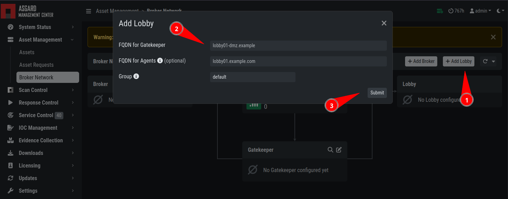

.. Index:: Broker Network Components

Installating the Broker Network Components
------------------------------------------

After the base installation of your servers is completed, you can install
the specific components.

Make sure you have a valid license for the ASGARD Management Center
with the **Broker Network** feature enabled.

.. figure:: ../images/broker_nextronInstaller.png
   :alt: the nextronInstaller

You can install the three servers in any order, as we will configure them once they are all up and running.

.. hint::
   In this example we went with the minimum of one Broker, one Lobby
   and one Gatekeeper. You can install multiple Brokers, depending
   on your environment and needs.

Gatekeeper Installation
~~~~~~~~~~~~~~~~~~~~~~~

To install the Gatekeeper, you need first configure it
in your Management Center. After you have configured/linked
the Gatekeeper, you will get a command which is needed for
the Nextron Universal Installer.

.. figure:: ../images/setup_gatekeeper-command.png
   :alt: Integration Command for the Gatekeeper

Once you saved the command, you can proceed with the
installation. Choose "ASGARD Gatekeeper" and continue to
follow the instructions of the Nextron Universal Installer.

The installation is completed once the Installer prompts
you to reboot the server.

Lobby Installation
~~~~~~~~~~~~~~~~~~

To install the Lobby, you need first add a Lobby in your
Management Center. After you have added the Lobby, you can
download the configuration file, which is needed for the
installation.

.. figure:: ../images/setup_lobby-command.png
   :alt: Lobby Configuration File

Once you downloaded the configuration file, you can proceed
with the installation. Choose "ASGARD Lobby" and continue to
follow the instructions of the Nextron Universal Installer.

The installation is completed once the Installer prompts
you to reboot the server.

Broker Installation
~~~~~~~~~~~~~~~~~~~

To install the Broker, you need first add a Broker in your
Management Center. After you have added the Broker, your
Management Center will display a command which is needed
for the Nextron Universal Installer.

.. figure:: ../images/setup_broker-command.png
   :alt: Integration Command for the Broker

Once you saved the command, you can proceed with the
installation. Choose "ASGARD Broker" and continue to
follow the instructions of the Nextron Universal Installer.

The installation is completed once the Installer prompts
you to reboot the server.