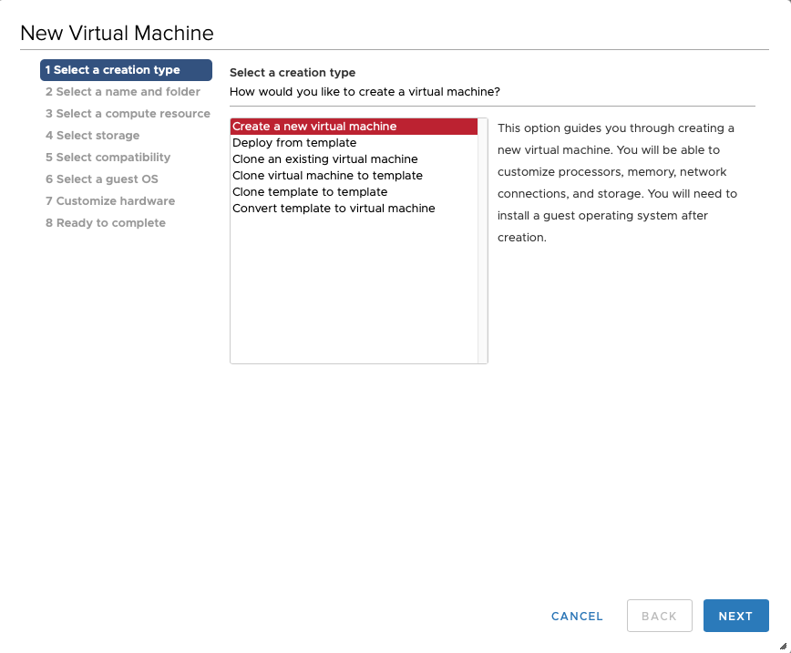
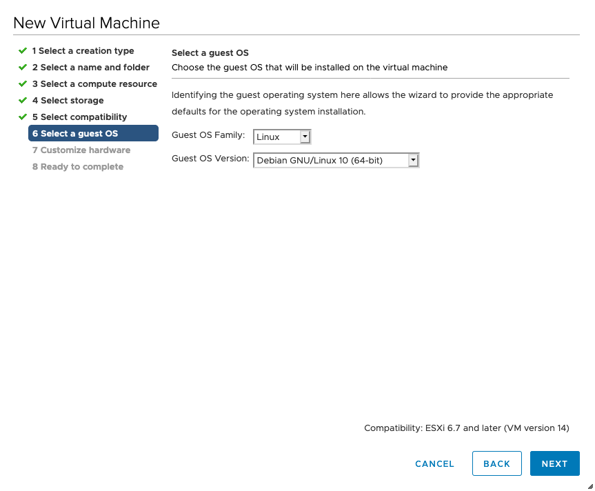

.. index:: ESXi VM

Overview of the Components
--------------------------

There are three components which are needed for the Broker Network:

   * **Lobby** - New ASGARD Agents will get a certificate for a secure communication from
     the Lobby. An administrator can accept the agents or configure the auto-accept option.
     Certificates for agents can also be revoked here.
   * **Gatekeeper** - The Gatekeeper is used to communicate directly between all the components.
     Certificates and Revoke Lists get picked up from the Lobby and are being pushed to all Brokers.
   * **Broker** - Your Broker(s) are the component which your ASGARD Agents communicate with.
     Once an ASGARD Agent received a valid certificate from the Lobby, communication is possible.
     You can have multiple Brokers configured.

.. figure:: ../images/broker_network_overview.png
   :alt: The Broker Network

In this guide, we will assume a scenario with only one Broker, one Lobby and one Gatekeeper.
If you wish to install multiple smaller sized Brokers, you can do so.

Create a new ESX VM and mount the ISO
-------------------------------------

.. note::
   This step has to be done three times, we need one dedicated server for each component.
   Please see :ref:`requirements/hardware:hardware requirements` for the hardware requirements.

Create a new VM with your virtualization software. In this case, we will use VMWare ESX managed through a VMWare VCenter.

The new VM must be configured with a Linux base system and Debian GNU/Linux 10 (64 bits) as
target version. It is recommended to upload the ASGARD ISO to an accessible data store
and mount the same to your newly created VM. 

.. figure:: ../images/setup_esx2.png
   :alt: New Virtual Machine - ESX

.. figure:: ../images/setup_esx4.png
   :alt: New Virtual Machine - ESX

Please make sure to select a suitable v-switch or physical interface that reflects
the IP address scheme you are planning to use for the new ASGARD.