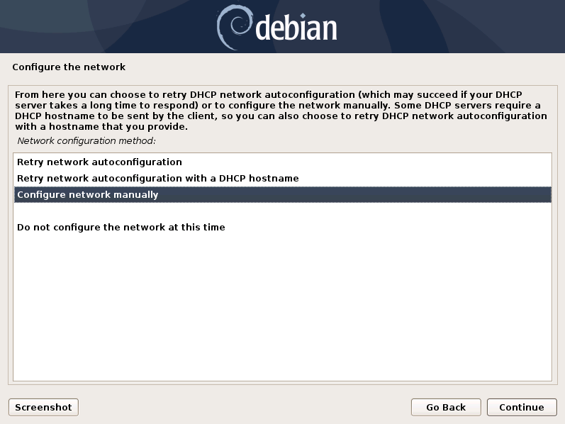
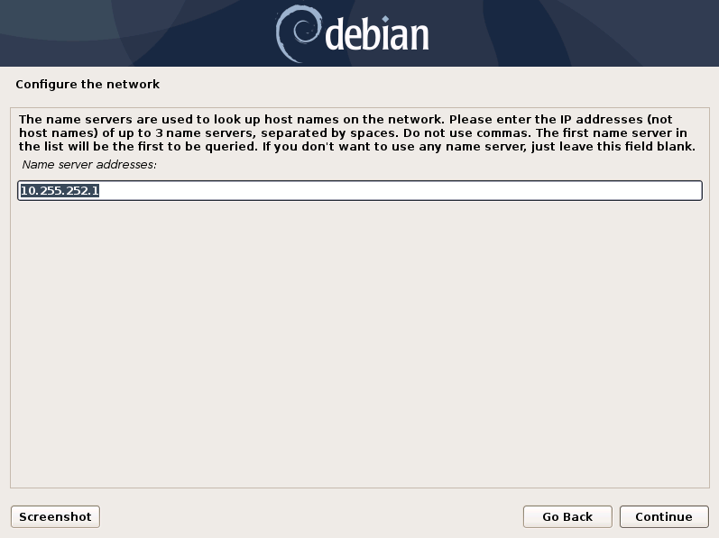
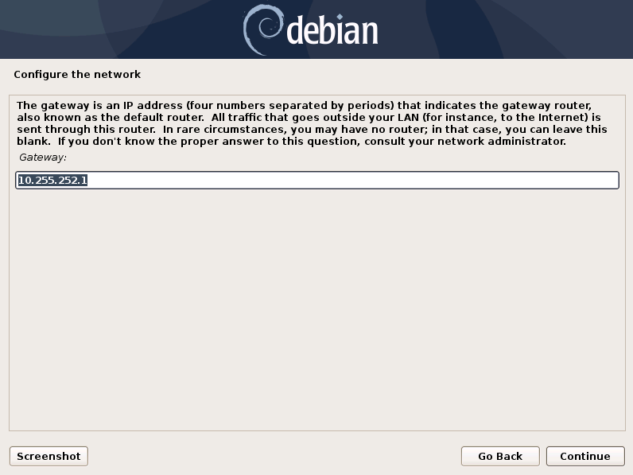

.. index:: ESXi VM

Installing the Base OS
======================

In this chapter we will walk you through our
ISO Installer. The ISO Installer is a Debian 12
(64 bits) based installer which will guide you
through the installation of the base OS.

Overview of the Components
--------------------------

There are three components which are needed for the Broker Network:

   * **Lobby** - New ASGARD Agents will get a certificate for a secure communication from
     the Lobby. An administrator can accept the agents or configure the auto-accept option.
     Certificates for agents can also be revoked here.
   * **Gatekeeper** - The Gatekeeper is used to communicate directly between all the components.
     Certificates and Revoke Lists get picked up from the Lobby and are being pushed to all Brokers.
   * **Broker** - Your Broker(s) are the component which your ASGARD Agents communicate with.
     Once an ASGARD Agent received a valid certificate from the Lobby, communication is possible.
     You can have multiple Brokers configured.

.. figure:: ../images/broker_network_overview.png
   :alt: The Broker Network

In this guide, we will assume a scenario with only one Broker, one Lobby and one Gatekeeper.
If you wish to install multiple smaller sized Brokers, you can do so.

Create a new ESX VM and mount the ISO
-------------------------------------

.. note::
   This step has to be done three times, we need one dedicated server for each component.
   Please see :ref:`requirements/hardware:hardware requirements` for the hardware requirements.

Create a new VM with your virtualization software. In this case, we will use VMWare ESX managed through a VMWare VCenter.

The new VM must be configured with a Linux base system and Debian GNU/Linux 10 (64 bits) as
target version. It is recommended to upload the ASGARD ISO to an accessible data store
and mount the same to your newly created VM. 

.. figure:: ../images/setup_esx1.png
   :alt: New Virtual Machine - ESX

.. figure:: ../images/setup_esx2.png
   :alt: New Virtual Machine - ESX

.. figure:: ../images/setup_esx3.png
   :alt: New Virtual Machine - ESX

.. figure:: ../images/setup_esx4.png
   :alt: New Virtual Machine - ESX

Please make sure to select a suitable v-switch or physical interface that reflects
the IP address scheme you are planning to use for the new ASGARD.

.. index:: Installer

Navigate through the Installer
------------------------------

The installation Process is started by clicking on ASGARD Graphical install.
The installer then loads the additional components from the ISO and lets you select location and language.

.. figure:: ../images/setup_language.png
   :alt: Select a language

.. figure:: ../images/setup_location1.png
   :alt: Select your location

.. figure:: ../images/setup_location2.png
   :alt: Select your location

.. warning::
   Please make sure to select the correct Country, as this will also set your local timezone!

.. figure:: ../images/setup_locales.png
   :alt: Configure locales

.. note::
   If DHCP is available, network parameters will be configured automatically.
   Without DHCP, ASGARD drops into the manual network configuration dialogue.
   The IP address can be changed later, see :ref:`setup/setup:changing the ip-address (optional)`

.. index:: Network Configuration

Network Configuration
---------------------

.. figure:: ../images/setup_network1.png
   :alt: Configure the network

.. figure:: ../images/setup_network3.png
   :alt: Configure the network

.. warning::
   ASGARD needs to be able to resolve internal and external IP addresses.

.. figure:: ../images/setup_network6.png
   :alt: Configure the network

.. warning::
   **Important:** Make sure that the combination of hostname and domain
   creates an FQDN that can be resolved from the endpoints on which you
   intend to install the ASGARD agents. If you've configured a FQDN (hostname + domain)
   that cannot be resolved on the clients, no agent will be able to find and reconnect to the ASGARD server. 

.. figure:: ../images/setup_network7.png
   :alt: Configure the network

.. index:: Other Setup

Choosing a Password
-------------------

.. figure:: ../images/setup_password.png
   :alt: Set up users and passwords

   Choosing a password for the ``nextron`` user

Partitioning of the Hard Disk
-----------------------------

.. figure:: ../images/setup_disks1.png
   :alt: Partition disks

Finally, write your configuration to the disk by selecting "Yes" and clicking "Continue".

.. figure:: ../images/setup_disks2.png
   :alt: Partition disks

If you are using a proxy to access the internet, enter the proxy details
in the next step. Please note, **Internet connectivity is required** for
the next step. 

Proxy Configuration
-------------------

.. figure:: ../images/setup_proxy.png
   :alt: Finish the installation

The base installation is now complete. In the next step we will install
the Broker Network Components. For this step **Internet connectivity is required**.

Use SSH to connect to the appliance using the user ``nextron``
and the password you specified during the installation. If SSH is
not available, you can perform the next steps via the Console of
your Virtualization Host, though SSH has more possibilities.

.. index:: Configure OS

Changing the IP-Address (optional)
----------------------------------

You components IP Addresses can be changed in **/etc/network/interfaces**. The IP is configured with the address variable.

.. code-block:: console

   nextron@asgard:~$ sudo vi /etc/network/interfaces

.. code-block::

   auto ens32
   iface ens32 inet static
   address 192.0.2.7
   netmask 255.255.255.0
   gateway 192.0.2.254

.. note::
   There might be a case where the name of the network interface (in this example: ``ens32``) is different.
   To verify this you can run ``ip a`` and see the name of the network interface.

The new IP can be applied with the command ``sudo systemctl restart networking``.

Make sure to update the A-Records in your local DNS Server to reflect the IP changes.

Verifying DNS Settings
----------------------

To verify if your components are using the correct DNS Server, you can inspect the file ``/etc/resolv.conf``:

.. code-block:: console

   nextron@asgard-ac:~$ cat /etc/resolv.conf 
   search example.org
   nameserver 172.16.200.2

If you see errors in this configuration, you can change it with the following command:

.. code-block:: console

   nextron@asgard-ac:~$ sudoedit /etc/resolv.conf