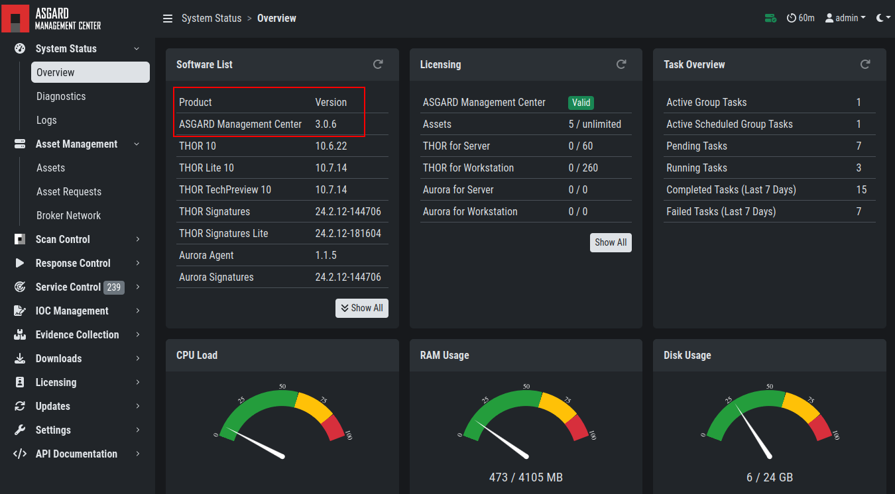
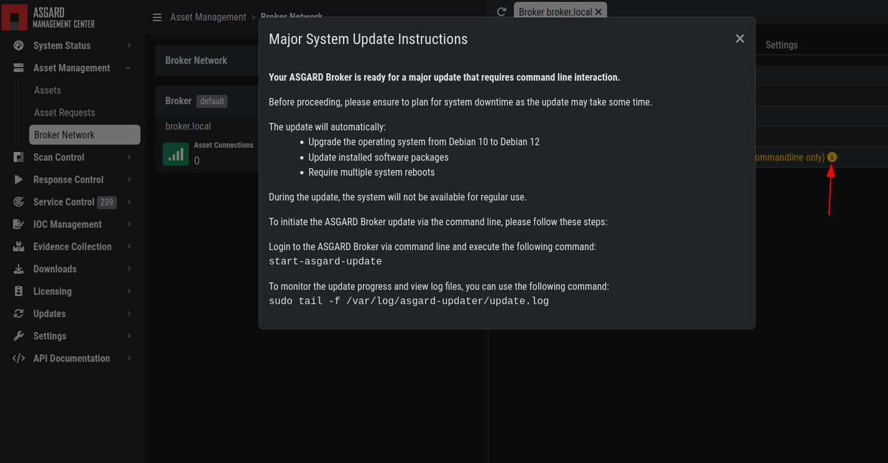
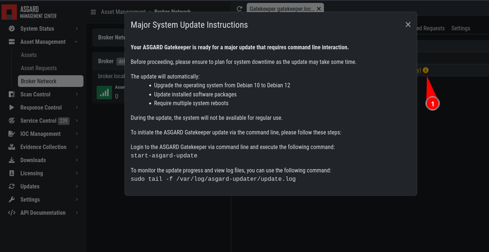
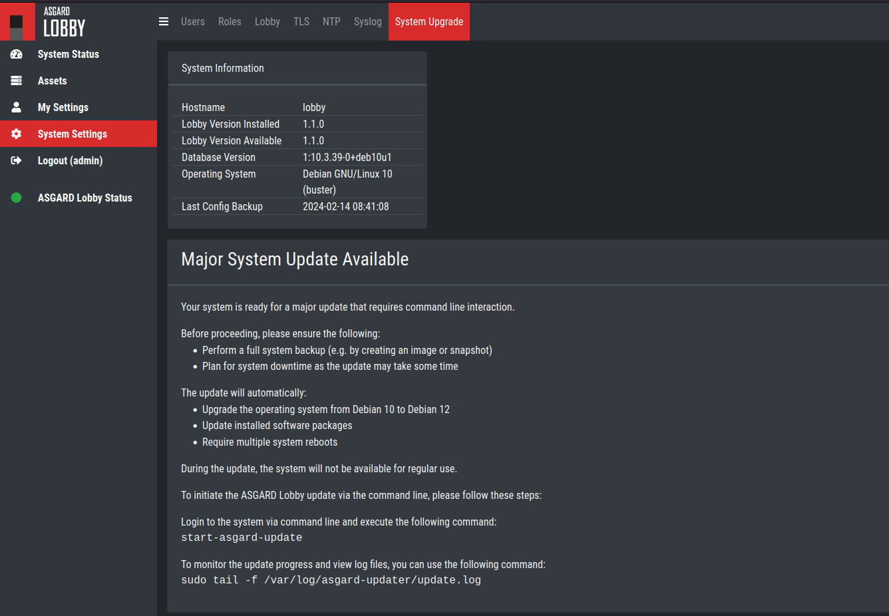

.. index:: Broker Network Major Updates

Major Updates
=============

This chapter guides you through the update process of
your ASGARD Broker Network components.

It is important to follow the steps carefully. We advise you
to create a snapshot of the Gatekeeper and Lobby before starting
your update. The Lobby and Gatekeeper contain certificates for
your agents to connect through the broker endpoints. If those
certificates get lost (i.e. the update failes and you need to
reinstall), you need to re-connect all your agents again.

.. note::
    You can start the update process on all your components
    simultaneously. The updates take a while and your components
    will be offline for the duration of the update.

Preparation
^^^^^^^^^^^

To prepare for your update, we compiled a list of tasks you
should follow:

.. list-table:: 
    :header-rows: 1

    * - Task
      - Description
    * - Snapshot of your Gatekeeper
      - For disaster recovery
    * - Snapshot of your Lobby
      - For disaster recovery
    * - Management Center running version 3.x
      - Prerequisite for the Updates
    * - Connection to our new update servers
      - New update server infrastructure

For details regarding some of the above tasks, see the next section
in this manual.

With the new version of your Broker Network, we also
made changes to our update servers. Please make sure
that all your components can reach the following servers:

.. list-table:: 
    :header-rows: 1

    * - Server
      - Port
      - Description
    * - update3.nextron-systems.com
      - tcp/443
      - Old update server
    * - update-301.nextron-systems.com
      - tcp/443
      - New update Server

The old update server is needed to fetch the updater and
other prerequisites. The new update server is needed to update
your servers to Debian 12 and also to install any new packages,
which are needed for your Broker Network components.

You can find the corresponding IP-Addresses to the above
FQDNs here: https://www.nextron-systems.com/hosts/.

Management Center running version 3.x
~~~~~~~~~~~~~~~~~~~~~~~~~~~~~~~~~~~~~

To check if your Management Center is running on the correct version
you can navigate to the ``Overview`` page. Here you can see the current
version of your Management Center.

   Management Center Version

Performing the updates
^^^^^^^^^^^^^^^^^^^^^^

In this section we will perform the actual update
of the your components.

ASGARD Broker
~~~~~~~~~~~~~

Navigate to ``Asset Management`` > ``Broker Network`` and
click the magnifying glass icon on your Broker(s).
You will see that there is a ``major upgrade`` available.
Click the yellow info icon next to the text and read the
information.

   Instructions for Broker update

To start your update, connect to your Broker(s) via
SSH. We will utilize ``asgard-updater`` to perform the
update. First we need to check if a newer version of the
``asgard-updater`` is available. If you get the highlighted
output, you have already the newest version installed (the
version might differ from the output here):

.. code-block:: console
    :emphasize-lines: 6

    nextron@broker:~$ sudo apt update
    nextron@broker:~$ sudo apt install asgard-updater
    Reading package lists... Done
    Building dependency tree       
    Reading state information... Done
    asgard-updater is already the newest version (1.0.15).
    0 upgraded, 0 newly installed, 0 to remove and 0 not upgraded.

You can now run the ``asgard-updater`` with the following command:

.. code-block:: console

    nextron@broker:~$ start-asgard-update

The server running your Broker(s) will now restart
multiple times. It is important to not interrupt the update
process and let the server do all the tasks. You can, however, 
see if any errors occurred during the update or just observe
at what stage the update is.

Run the following command to see the status of your update:

.. code-block:: console

    nextron@broker:~$ sudo tail -f /var/log/asgard-updater/update.log

.. note::
    Since the update is downloading many packages of the debian
    base system, the process will take a while. Your Broker(s)
    might be online throughout the update sporadically, but we
    still advise to wait until the update is finished before
    changing anything on the system.

The update is finished if you are seeing the following lines:

.. code-block:: console

    nextron@broker:~$ sudo tail -f /var/log/asgard-updater/update.log
    2024-01-16T14:20:54.253032+01:00 broker asgard-updater[667]: Upgrade finished. Deactivating service...
    2024-01-16T14:20:54.259176+01:00 broker asgard-updater[667]: Removed "/etc/systemd/system/multi-user.target.wants/asgard-updater.service".

Your update is now finished.

ASGARD Gatekeeper
~~~~~~~~~~~~~~~~~

Navigate to ``Asset Management`` > ``Broker Network`` and
click the magnifying glass icon on your Gatekeeper.
You will see that there is a ``major upgrade`` available.
Click the yellow info icon next to the text and read the
information.

   Instructions for Gatekeeper update

To start your update, connect to your Gatekeeper via
SSH. We will utilize ``asgard-updater`` to perform the
update. First we need to check if a newer version of the
``asgard-updater`` is available. If you get the highlighted
output, you have already the newest version installed (the
version might differ from the output here):

.. code-block:: console
    :emphasize-lines: 6

    nextron@gatekeeper:~$ sudo apt update
    nextron@gatekeeper:~$ sudo apt install asgard-updater
    Reading package lists... Done
    Building dependency tree       
    Reading state information... Done
    asgard-updater is already the newest version (1.0.15).
    0 upgraded, 0 newly installed, 0 to remove and 0 not upgraded.

You can now run the ``asgard-updater`` with the following command:

.. code-block:: console

    nextron@gatekeeper:~$ start-asgard-update

The server running your Gatekeeper will now restart
multiple times. It is important to not interrupt the update
process and let the server do all the tasks. You can, however, 
see if any errors occurred during the update or just observe
at what stage the update is.

Run the following command to see the status of your update:

.. code-block:: console

    nextron@gatekeeper:~$ sudo tail -f /var/log/asgard-updater/update.log

.. note::
    Since the update is downloading many packages of the debian
    base system, the process will take a while. Your Gatekeeper
    might be online throughout the update sporadically, but we
    still advise to wait until the update is finished before
    changing anything on the system.

The update is finished if you are seeing the following lines:

.. code-block:: console

    nextron@gatekeeper:~$ sudo tail -f /var/log/asgard-updater/update.log
    2024-01-16T14:20:54.253032+01:00 gatekeeper asgard-updater[667]: Upgrade finished. Deactivating service...
    2024-01-16T14:20:54.259176+01:00 gatekeeper asgard-updater[667]: Removed "/etc/systemd/system/multi-user.target.wants/asgard-updater.service".

Your update is now finished.

ASGARD Lobby
~~~~~~~~~~~~

Navigate to ``System Settings`` > ``System Upgrade`` in your
Lobby's web interface. You will see a big notice with the
headline ``Major System Update Available``. If this is the
case, your Lobby is ready for the major update.

   Instructions for Lobby update

To start your update, connect to your Lobby via
SSH. We will utilize ``asgard-updater`` to perform the
update. First we need to check if a newer version of the
``asgard-updater`` is available. If you get the highlighted
output, you have already the newest version installed (the
version might differ from the output here):

.. code-block:: console
    :emphasize-lines: 6

    nextron@lobby:~$ sudo apt update
    nextron@lobby:~$ sudo apt install asgard-updater
    Reading package lists... Done
    Building dependency tree       
    Reading state information... Done
    asgard-updater is already the newest version (1.0.15).
    0 upgraded, 0 newly installed, 0 to remove and 0 not upgraded.

You can now run the ``asgard-updater`` with the following command:

.. code-block:: console

    nextron@lobby:~$ start-asgard-update

The server running your Lobby will now restart
multiple times. It is important to not interrupt the update
process and let the server do all the tasks. You can, however, 
see if any errors occurred during the update or just observe
at what stage the update is.

Run the following command to see the status of your update:

.. code-block:: console

    nextron@lobby:~$ sudo tail -f /var/log/asgard-updater/update.log

.. note::
    Since the update is downloading many packages of the debian
    base system, the process will take a while. Your Lobby
    might be online throughout the update sporadically, but we
    still advise to wait until the update is finished before
    changing anything on the system.

The update is finished if you are seeing the following lines:

.. code-block:: console

    nextron@lobby:~$ sudo tail -f /var/log/asgard-updater/update.log
    2024-01-16T14:20:54.253032+01:00 lobby asgard-updater[667]: Upgrade finished. Deactivating service...
    2024-01-16T14:20:54.259176+01:00 lobby asgard-updater[667]: Removed "/etc/systemd/system/multi-user.target.wants/asgard-updater.service".

Your update is now finished.