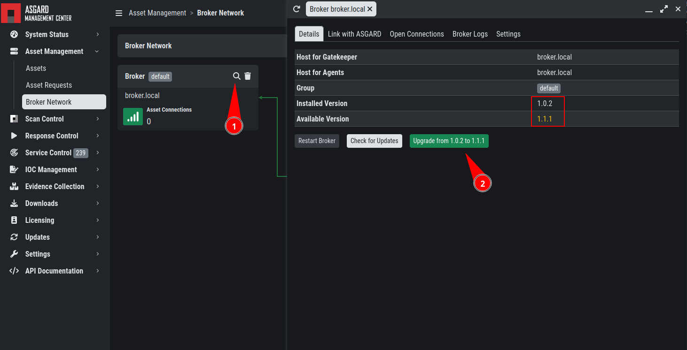
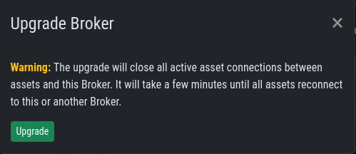
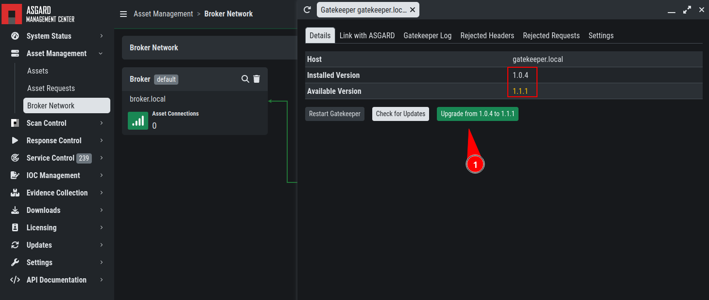
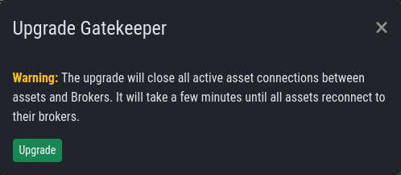
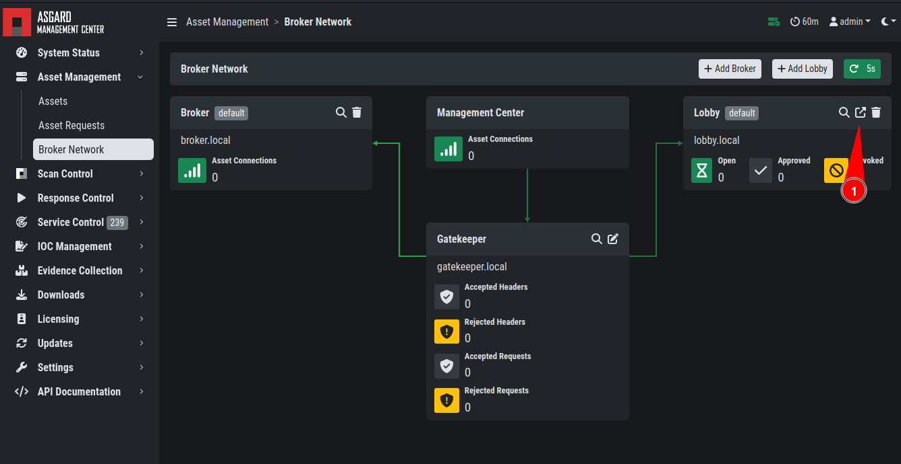
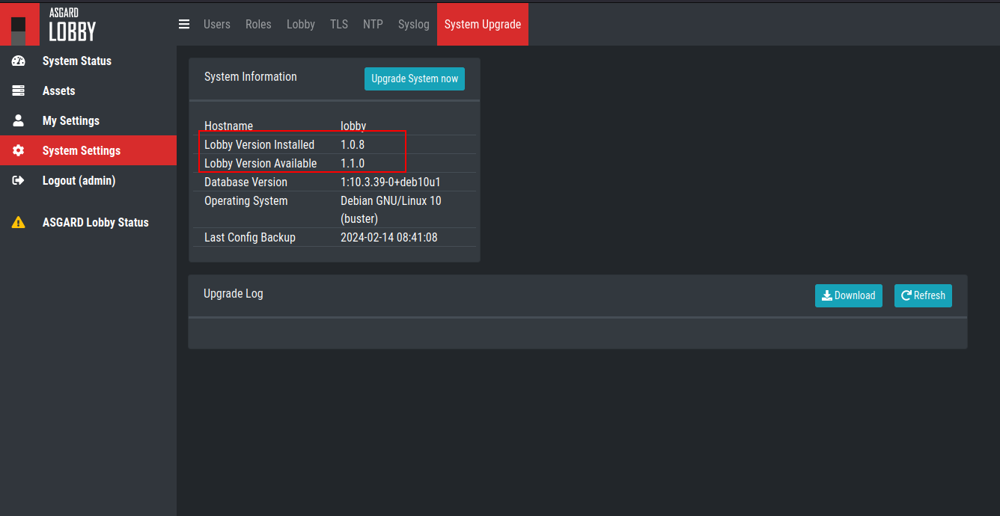
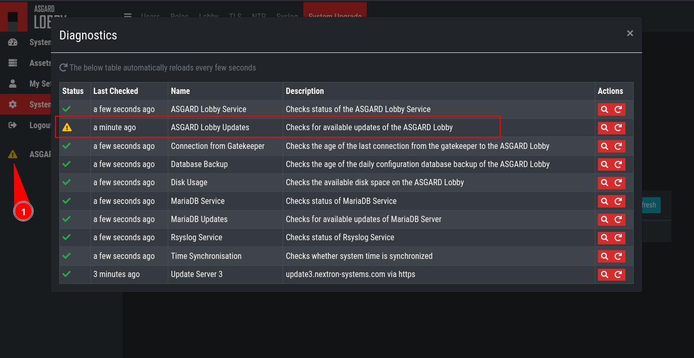

.. index:: Broker Network Minor Updates

Minor Updates
=============

This chapter guides you through the update process of
your ASGARD Broker Network components.

ASGARD Broker
~~~~~~~~~~~~~

You can see new available versions for your Broker(s)
if you open the details page for each Broker. To do
this, navigate to ``Asset Management`` > ``Broker
Network`` and click the magnifying glass icon next
to your Broker:

   Broker Minor Update

Click the ``Update from X to Y`` Button. A popup will
appear. Please read the information carefully and proceed
with the Update.

   Broker Minor Update Confirmation

The update process might take a few seconds, and you
will get some warnings in your ``Broker Network`` overview,
mainly that the connection to the broker is disrupted.
This is normal and should correct itself after the
service is up and running again.

ASGARD Gatekeeper
~~~~~~~~~~~~~~~~~

You can see new available versions for your Gatekeeper
if you open the details page. To do this, navigate to
``Asset Management`` > ``Broker Network`` and click the
magnifying glass icon next to your Gatekeeper:

   Gatekeeper Minor Update

Click the ``Update from X to Y`` Button. A popup will
appear. Please read the information carefully and proceed
with the Update.

   Gatekeeper Minor Update Confirmation

The update process might take a few seconds, and you
will get some warnings in your ``Broker Network`` overview,
mainly that the connection to the broker is disrupted.
This is normal and should correct itself after the
service is up and running again.

ASGARD Lobby
~~~~~~~~~~~~

To see if new updates for your Lobby are available,
open the webinterface via your ``Broker Network`` view.

To do this, navigate to ``Asset Management`` > ``Broker
Network`` and click the "open link" icon next to your Lobby:

   Lobby Minor Update

A new browser tab with the URL to your Lobby will be opened.
Log into the Lobby and navigate to ``System Settings`` > ``System
Upgrade``. You should see a new version available. You can also
see available updates via the status indicator on the left navigation
bar.

   Lobby Minor Update

   Lobby Minor Update

Click ``Upgrade System now`` to install the newest Lobby version.
The Upgrade might take a while, and you will also see "Connectivity
Issues" in your ``Broker Network`` tab on the Management Center, but
this will correct itself once the Lobby has been updated successfully.