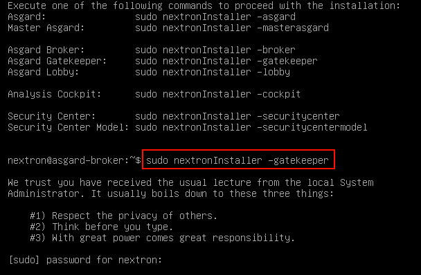
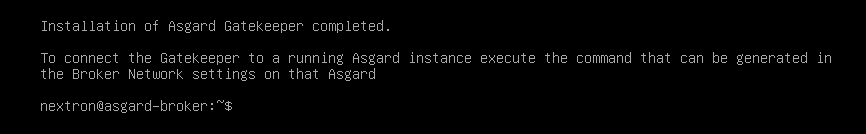
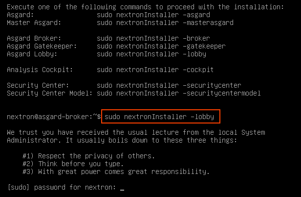
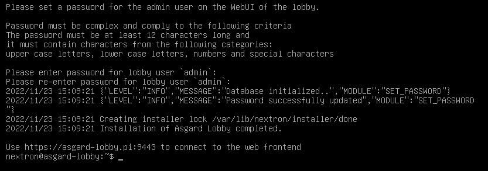
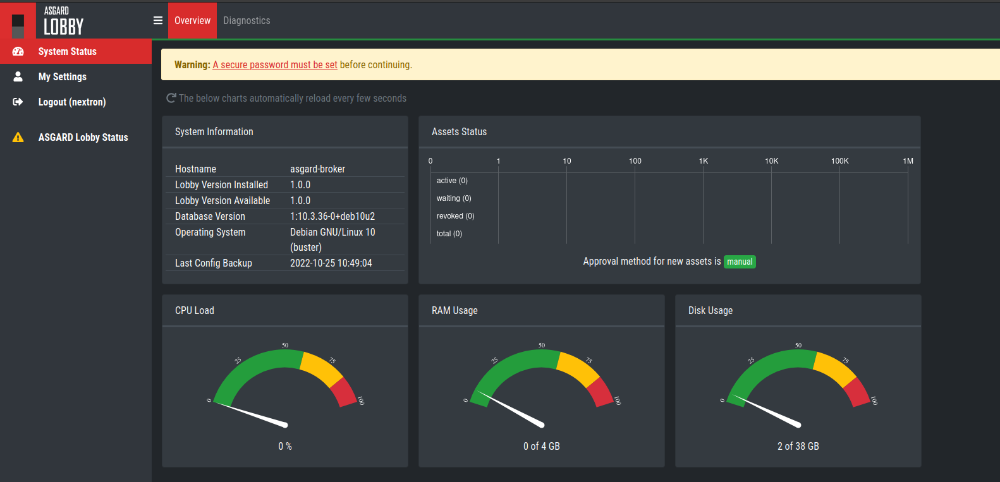
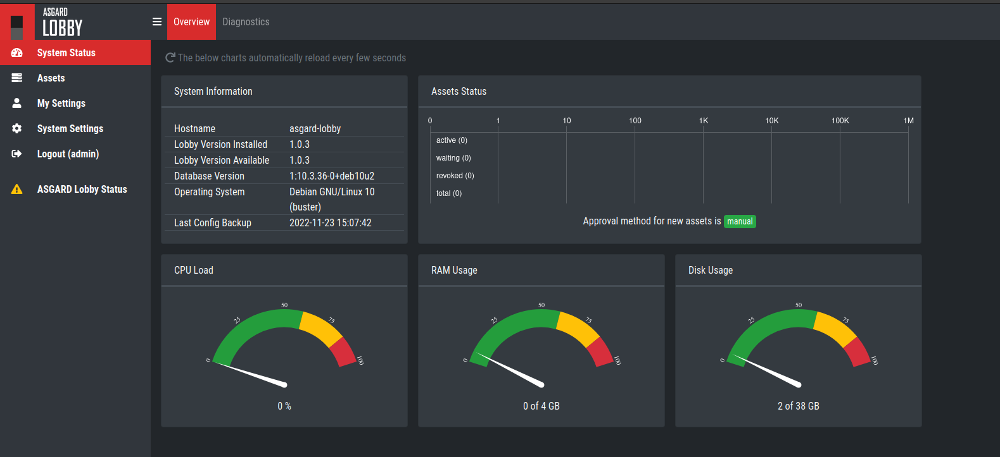
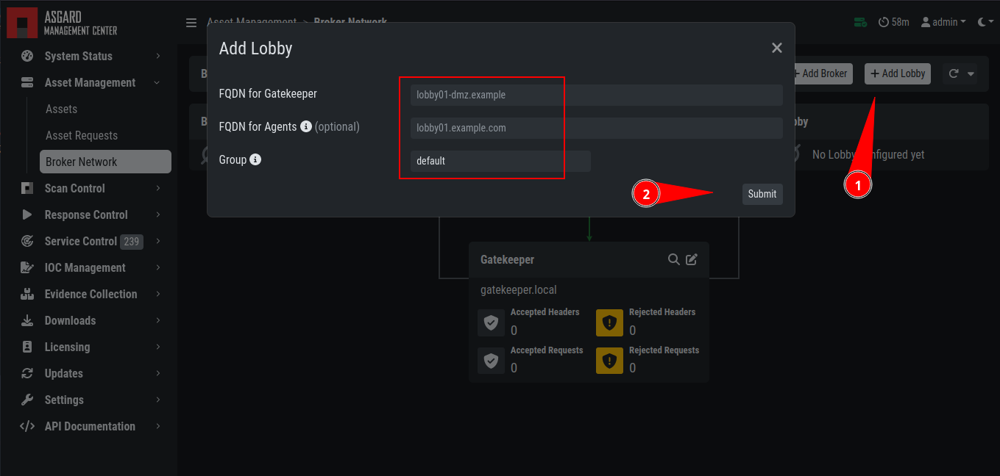
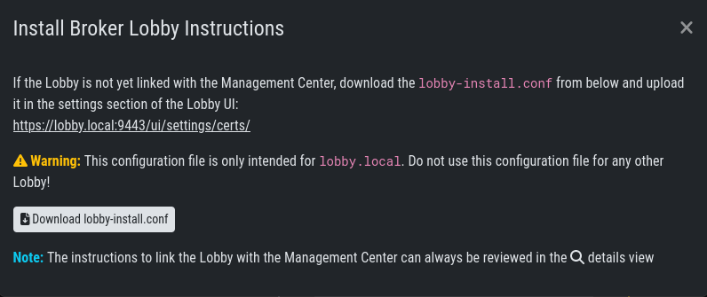
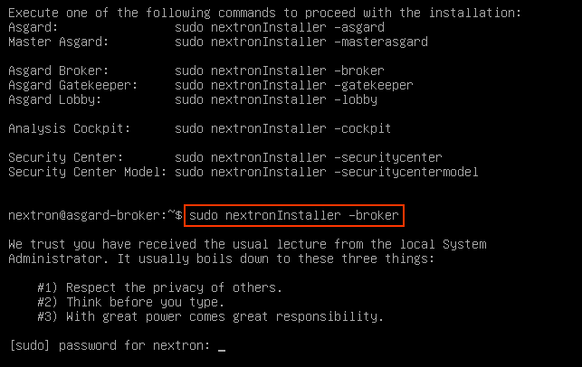
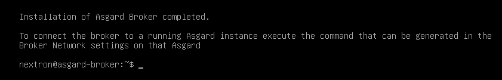

Administration
==============

Installation of the Components
------------------------------

The installation can be done as usual after the base image was installed via the ISO. After the installation is done, you can choose the role you want to install:

.. figure:: ../images/broker_nextronInstaller.png
   :target: ../_images/broker_nextronInstaller.png
   :alt: the nextronInstaller

You can install the three servers in any order, as we will configure them once they are all up and running.

.. warning::
   The Broker Network needs a minimum version of 2.14.0 of the ASGARD Management Center. Please make sure you installed your Broker Network license in your ASGARD.

Gatekeeper
----------

To install the Gatekeeper, run the following command on a newly installed system:

.. code-block:: console
    
    nextron@gatekeeper:~$ sudo nextronInstaller -gatekeeper

After the installation is done, you will see the following message:

You can now check if the service was installed successfully. To do this, run:

.. code-block:: console
    
    nextron@gatekeeper:~$ sudo systemctl status asgard2-gatekeeper.service
    
You will see that the service is in a ``failed/exited`` state. This will change once we configured our ASGARD with the Gatekeeper and you can ignore this for now.

To configure your Gatekeeper in the ASGARD Management Center, navigate to ``Asset Management`` > ``Broker Network``. If you do not see the ``Broker Network`` tab, you didn't install the correct license yet for your ASGARD.

From here you can click the edit button on the Gatekeeper:

.. figure:: ../images/setup_gatekeeper3.png
   :target: ../_images/setup_gatekeeper3.png
   :alt: Setting up the Gatekeeper

Once you clicked on the Edit Button, a pop-up will appear. Please set the FQDN of your gatekeeper.

.. figure:: ../images/setup_gatekeeper4.png
   :target: ../_images/setup_gatekeeper4.png
   :alt: Setting up the Gatekeeper

After you confirmed your Gatekeeper FQDN, you will get another pop-up with a command (``sudo asgard2-gatekeeper-install '<TOKEN>'``). Please copy this command and execute it on the gatekeeper via SSH:

.. figure:: ../images/setup_gatekeeper5.png
   :target: ../_images/setup_gatekeeper5.png
   :alt: Setting up Gatekeeper

.. figure:: ../images/setup_gatekeeper6.png
   :target: ../_images/setup_gatekeeper6.png
   :alt: Setting up the Gatekeeper

Once you are done, you can check the status and other settings of the Gatekeeper in your your ASGARD (magnifying glass icon):

.. figure:: ../images/setup_gatekeeper7.png
   :target: ../_images/setup_gatekeeper7.png
   :alt: Setting up the Gatekeeper

You might need to restart the Gatekeeper after the initial setup.

Lobby
-----

To install the Lobby, run the following command on a newly installed system: 

.. code-block:: console

    nextron@lobby:~$ sudo nextronInstaller -lobby

After the installation is finished, you will see the following message:

.. figure:: ../images/setup_lobby2.png
   :target: ../_images/setup_lobby2.png
   :alt: Installing the Lobby

You can check the service to see if everything is up and running. To do this, run:

.. code-block:: console
    
    nextron@lobby:~$ sudo systemctl status asgard-lobby.service

You can now navigate to the web interface of the lobby ``https://<FQDN>:9443``. Please log into the Lobby with the credentials of the user ``nextron``:

For the next steps, we need to set a secure password for the ``nextron`` user. This user will be only used to manage users on the Lobbies web interface. After changing the password, we need to create an administrative user. Changing the ``nextron`` users web password will not change the SSH password of the user!

After changing the password, you will be logged out of the Lobby. Log back into the Lobby. You are now able to see on the left navigation menu ``System Settings``. Go to the System Settings and add a new user. Make sure the new user has the ``Admin`` Role:

You can now log out of the Lobby and back in with the new admin user. You are now able to see on the left navigation menu ``Assets``. This will be used later on to accept new assets.

To configure your Lobby in the ASGARD Management Center, navigate to ``Asset Management`` > ``Broker Network``. If you do not see the ``Broker Network`` tab, you didn't install the correct license yet for your ASGARD. You can now add a new Lobby on the top right corner. Please fill in the FQDN again and click ``Submit``. You can assign a ``Group`` to group multiple Lobbies and Broker into one Group. If you are planning to only use one Lobby you can leave the value as ``default``. A pop-up will appear with configuration instructions. Download the configuration file, we will use this now in our Lobby.

.. figure:: ../images/setup_lobby8.png
   :target: ../_images/setup_lobby8.png
   :alt: Using the Lobby

In your Lobby, navigate to ``System Settings`` > ``Lobby``. Here you can upload the configuration file we downloaded in the last step:

.. figure:: ../images/setup_lobby9.png
   :target: ../_images/setup_lobby9.png
   :alt: Using the Lobby

After you uploaded the configuration to your Lobby, you should now see that the Lobby is connected with your ASGARD Management Center:

.. figure:: ../images/setup_lobby10.png
   :target: ../_images/setup_lobby10.png
   :alt: Using the Lobby

.. note:: 
    You might need to restart the Lobby after the initial setup.

Broker
------

To install a Broker, run the following command on a newly installed system:

.. code-block:: console
    
    nextron@broker:~$ sudo nextronInstaller -broker

After the installation is finished, you will see the following message:

You can now check if the service was installed successfully. To do this, run

.. code-block:: console
    
    nextron@broker:~$ systemctl status asgard-broker.service
    
 You will see that the service is in a ``failed/exited`` state. This will change once we configured our ASGARD with the Broker and can be ingored for now.

To configure your Broker in the ASGARD Management Center, navigate to ``Asset Management`` > ``Broker Network``. If you do not see the ``Broker Network`` tab, you didn't install the correct license yet for your ASGARD.

On the top right corner, click ``Add Broker``. Please fill in the FQDN for the Gatekeeper. Additionally, if the Broker should be reached via the open internet, you can assign a FQDN for the agents as well (make sure to set the A-Record in your public domain). You can leave the ``Group`` as default, but should change it accordingly if you set a different group earlier for your Lobby.

.. figure:: ../images/setup_broker3.png
   :target: ../_images/setup_broker3.png
   :alt: Installing the Broker

After you confirmed your Broker FQDN, you will get another pop-up with a command (``sudo asgard2-gatekeeper-install '<TOKEN>'``). Please copy this command and execute it on the broker via SSH:

.. figure:: ../images/setup_broker4.png
   :target: ../_images/setup_broker4.png
   :alt: Setting up the Broker

.. figure:: ../images/setup_broker5.png
   :target: ../_images/setup_broker5.png
   :alt: Setting up the Broker

Once you are done, you can check the status and other settings of the Gatekeeper in your your ASGARD (magnifying glass icon):

.. figure:: ../images/setup_broker6.png
   :target: ../_images/setup_broker6.png
   :alt: Setting up the Broker

You might need to restart the Broker after the initial setup.

Agent Installer
---------------

After the Broker Network has been set up, you need to create a new Agent Installer. To do this, navigate on your ASGARD to ``Downloads`` > ``Agent Installers``. From here you can choose ``Add Agent Installers`` and set the configuration to your liking. Most importantly here is the Option for ``Broker Groups``. Set this to the value which you gave your Lobby and your Broker(s). After you added the agent installer, make sure to install it on the agents.

.. figure:: ../images/setup_agent_installer1.png
   :target: ../_images/setup_agent_installer1.png
   :alt: New Agent Installer

.. figure:: ../images/setup_agent_installer2.png
   :target: ../_images/setup_agent_installer2.png
   :alt: New Agent Installer
