Administration
==============

Installation of the Components
------------------------------

The installation can be done as usual after the base image was installed via the ISO. After the installation is done, you can choose the role you want to install:

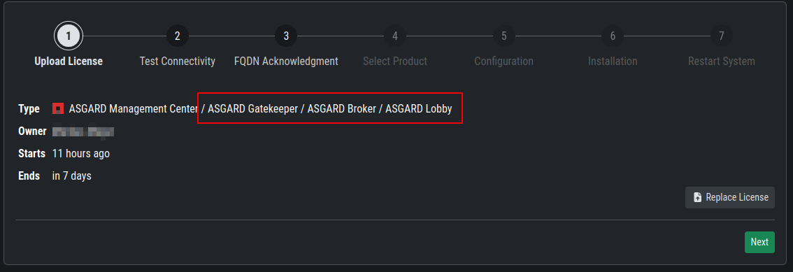

You can install the three servers in any order, as we will configure them once they are all up and running.

.. warning::
   The Broker Network needs a minimum version of 2.14.0 of the ASGARD Management Center. Please make sure you installed your Broker Network license in your ASGARD.
   If you still can't see the ``Broker Network`` Tab in your ``Asset Management``, restart the ``asgard2`` service in ``Settings`` > ``System`` > ``Services``.

Gatekeeper
----------

Once you installed your Gatekeeper via the ``nextronInstaller`` you can start to configure it.

To do this, we have to connect to our ASGARD Management Center. Navigate to ``Asset Management`` > ``Broker Network``.

From here you can click the edit button on the Gatekeeper:

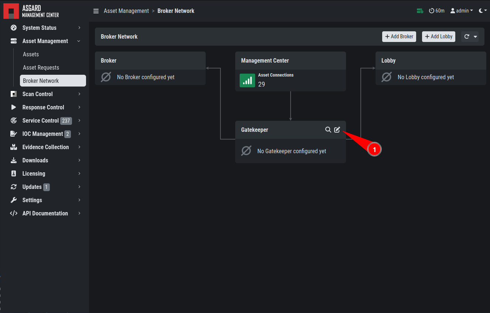

Once you clicked on the Edit Button, a pop-up will appear. Please set the FQDN of your gatekeeper.

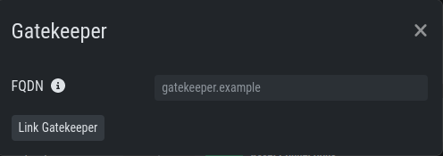

After you confirmed your Gatekeeper FQDN, you will get another pop-up with a command (``sudo asgard2-gatekeeper-install '<TOKEN>'``). Please copy this command and execute it on the gatekeeper via SSH:

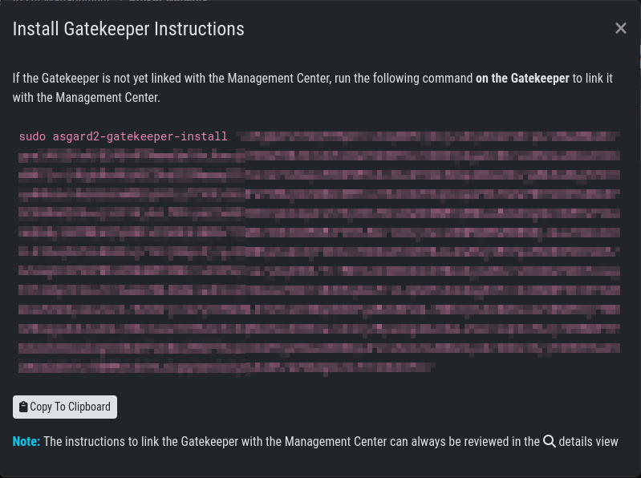

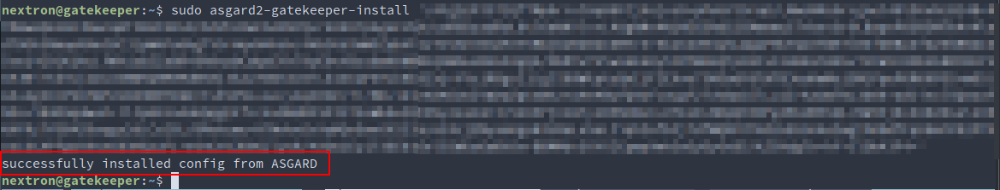

Once you are done, you can check the status and other settings of the Gatekeeper in your your ASGARD (magnifying glass icon):

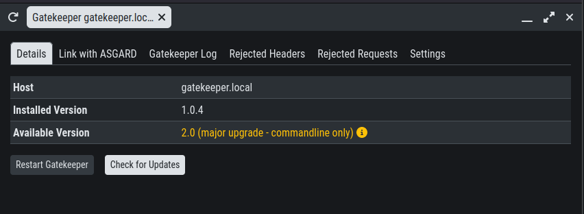

You might need to restart the Gatekeeper after the initial setup.

To see if the Gatekeeper is running correctly, you can run the following command:

.. code-block:: console

   nextron@broker:~$ systemctl status asgard2-gatekeeper.service 
   ● asgard2-gatekeeper.service - ASGARD 2 Gatekeeper
     Loaded: loaded (/lib/systemd/system/asgard2-gatekeeper.service; enabled; vendor preset: enabled)
     Active: active (running) since Fri 2022-11-04 08:40:15 CET; 17s ago
   Main PID: 1826 (bash)
      Tasks: 7 (limit: 4667)
     Memory: 13.3M
     CGroup: /system.slice/asgard2-gatekeeper.service
             ├─1826 /bin/bash /etc/asgard2-gatekeeper/run_asgard2_gatekeeper.sh
             └─1827 /usr/bin/asgard2-gatekeeper

Lobby
-----

Once you installed your Lobby via the ``nextronInstaller`` you can start to configure it.

To do this, we have to connect to our ASGARD Management Center. Navigate to ``Asset Management`` > ``Broker Network``. You can now add a new Lobby on the top right corner. Please fill in the FQDN again and click ``Submit``. You can assign a ``Group`` to group the Lobby and one or multiple Broker into one group. If you are planning to only use one Lobby you can leave the value as ``default``. A pop-up will appear with configuration instructions. Download the configuration file, we will use this now in our Lobby.

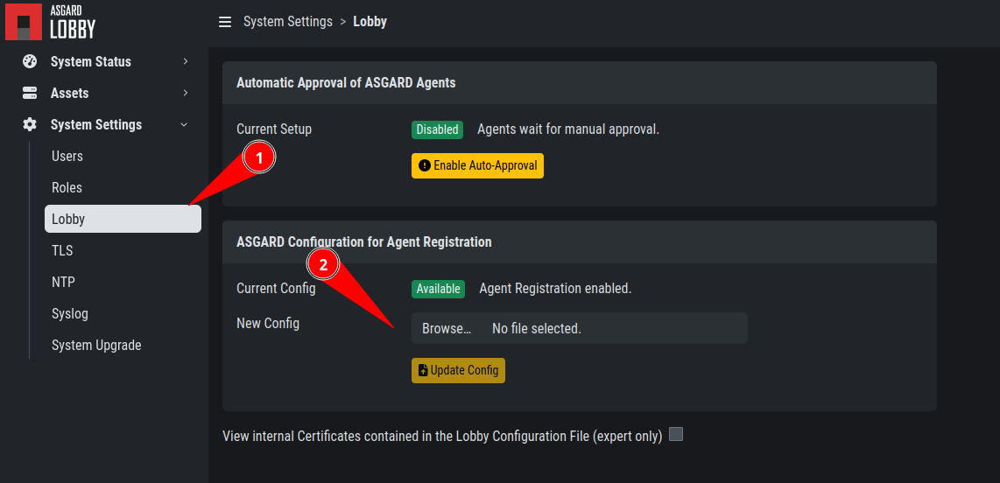

In your Lobby, navigate to ``System Settings`` > ``Lobby``. Here you can upload the configuration file we downloaded in the last step:

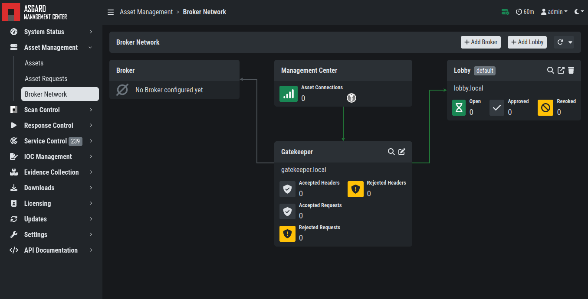

After you uploaded the configuration to your Lobby, you should now see that the Lobby is connected with your ASGARD Management Center:

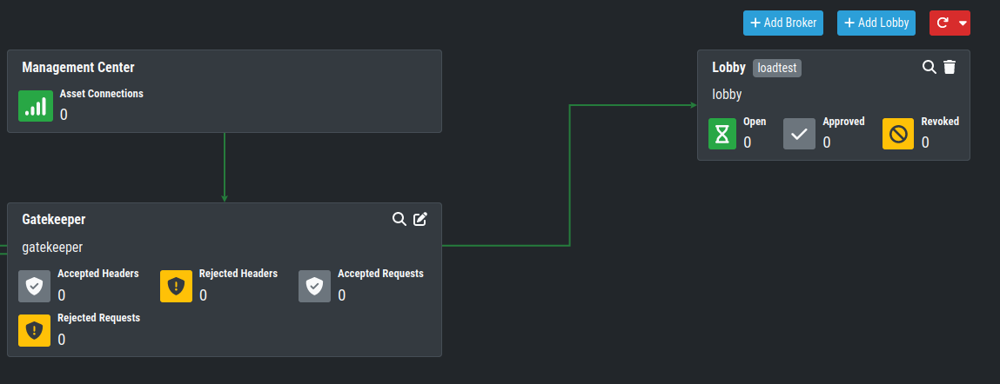

.. note:: 
    You might need to restart the Lobby after the initial setup.

Broker
------

Once you installed your Lobby via the ``nextronInstaller`` you can start to configure it.

To do this, we have to connect to our ASGARD Management Center. Navigate to ``Asset Management`` > ``Broker Network``.

On the top right corner, click ``Add Broker``. Please fill in the FQDN for the Gatekeeper. Additionally, if the Broker should be reached via the open internet, you can assign a FQDN for the agents as well (make sure to set the A-Record in your public domain). You can leave the ``Group`` as default, but should change it accordingly if you set a different group earlier for your Lobby.

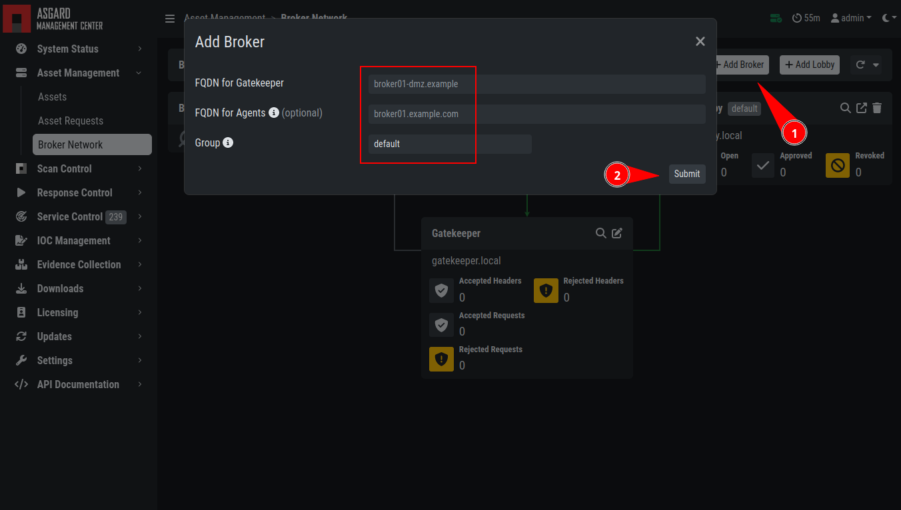

After you confirmed your Broker FQDN, you will get another pop-up with a command (``sudo asgard2-gatekeeper-install '<TOKEN>'``). Please copy this command and execute it on the broker via SSH:

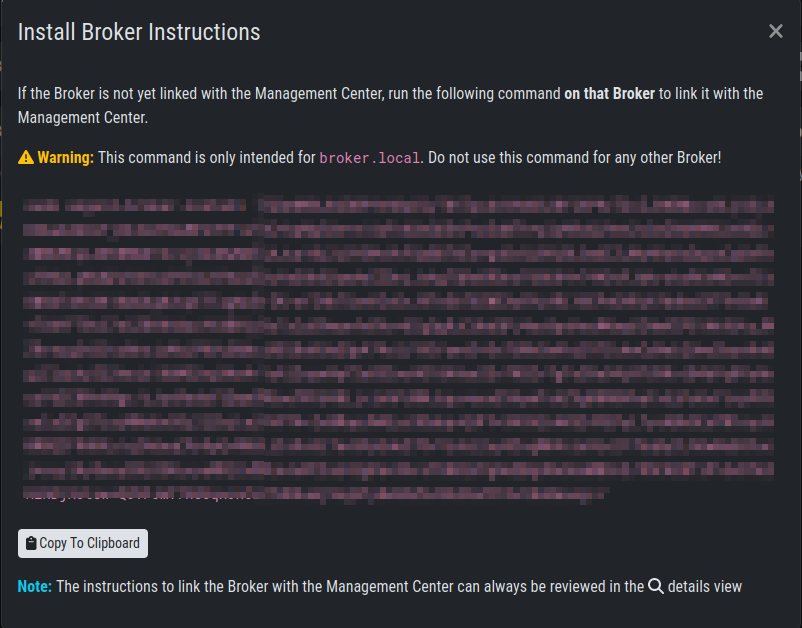

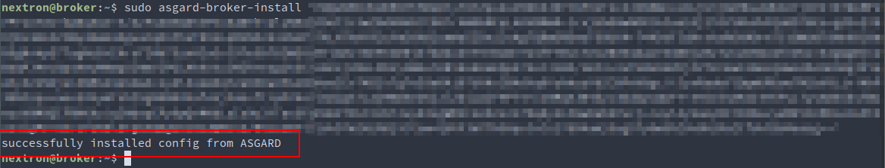

Once you are done, you can check the status and other settings of the Gatekeeper in your your ASGARD (magnifying glass icon):

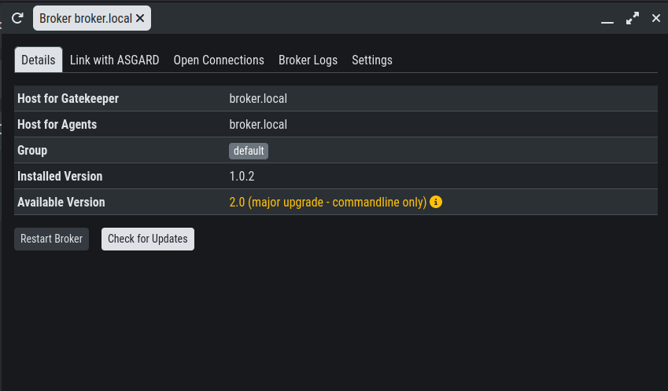

You might need to restart the Broker after the initial setup.

To see if the Gatekeeper is running correctly, you can run the following command:

.. code-block:: console

   nextron@broker:~$ systemctl status asgard-broker.service 
   ● asgard-broker.service - ASGARD Broker
     Loaded: loaded (/lib/systemd/system/asgard-broker.service; enabled; vendor preset: enabled)
     Active: active (running) since Fri 2022-10-28 09:55:50 CEST; 6 days ago
   Main PID: 10235 (bash)
      Tasks: 19 (limit: 4698)
     Memory: 1.4G
     CGroup: /system.slice/asgard-broker.service
             ├─10235 /bin/bash /etc/asgard-broker/run_asgard_broker.sh
             ├─10236 asgard-broker

Agent Installer
---------------

After the Broker Network has been set up, you need to create a new Agent Installer. To do this, navigate on your ASGARD to ``Downloads`` > ``Agent Installers``. From here you can choose ``Add Agent Installers`` and set the configuration to your liking. Most importantly here is the Option for ``Broker Groups``. Set this to the value which you gave your Lobby and your Broker(s). After you added the agent installer, make sure to install it on the agents.

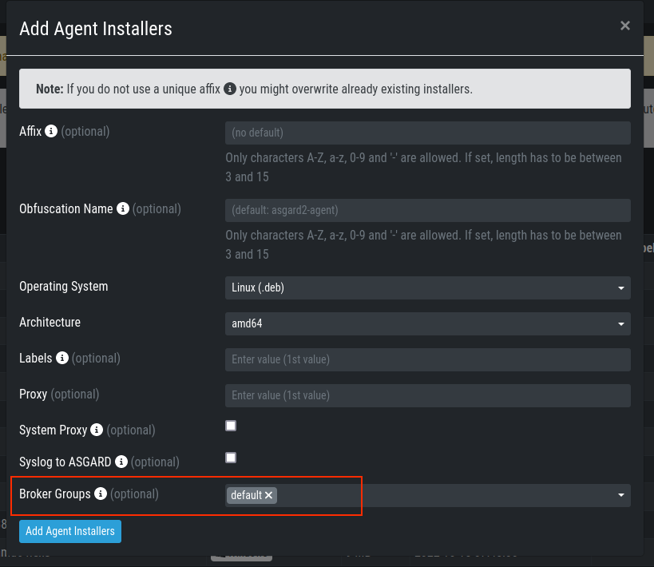

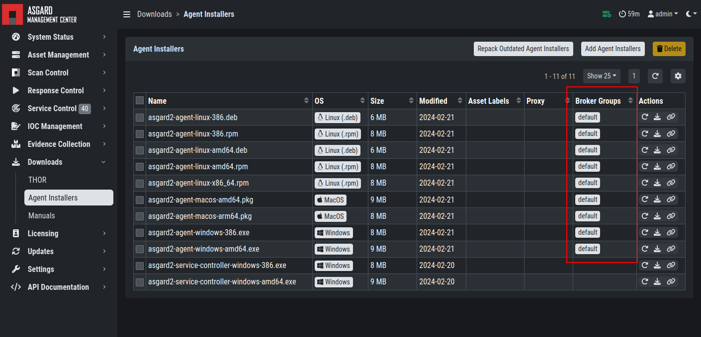
