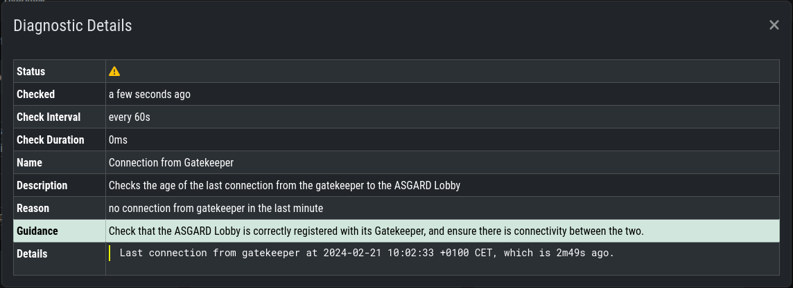
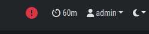

Administration
==============

Configuration of the Components
-------------------------------

The installation can be done as usual after the base image was installed via the ISO file.
After the installation is done, you can choose the role you want to install:

.. figure:: ../images/broker_nextronInstaller.png
   :alt: the nextronInstaller

You can install the three servers in any order, as we will configure them once they are all up and running.

.. warning::
   The Broker Network needs a minimum version of 2.14.0 of the ASGARD Management Center.
   Please make sure you installed your Broker Network license in your ASGARD.
   If you still can't see the ``Broker Network`` Tab in your ``Asset Management``,
   restart the ``asgard2`` service in ``Settings`` > ``System`` > ``Services``.

Gatekeeper Configuration
~~~~~~~~~~~~~~~~~~~~~~~~

Once you installed your Gatekeeper via the ``nextronInstaller`` you can start to configure it.

To do this, we have to connect the Gatekeeper to our ASGARD Management Center.
Navigate to ``Asset Management`` > ``Broker Network`` in your ASGARD Management Center.

From here you can click the edit button on the Gatekeeper:

.. figure:: ../images/setup_gatekeeper3.png
   :alt: Setting up the Gatekeeper

Once you clicked on the Edit Button, a pop-up will appear. Please set the FQDN of your gatekeeper.

.. figure:: ../images/setup_gatekeeper4.png
   :alt: Setting up the Gatekeeper

After you confirmed your Gatekeeper FQDN, you will get another pop-up with a
command (``sudo asgard2-gatekeeper-install '<TOKEN>'``). Please copy this
command and execute it on the gatekeeper via SSH:

.. figure:: ../images/setup_gatekeeper5.png
   :alt: Setting up Gatekeeper

.. figure:: ../images/setup_gatekeeper6.png
   :alt: Setting up the Gatekeeper

Once you are done, you can check the status and other settings of the Gatekeeper
in your your ASGARD (magnifying glass icon):

.. figure:: ../images/setup_gatekeeper7.png
   :alt: Setting up the Gatekeeper

To see if the Gatekeeper is running correctly, you can run the following command (status should be ``active (running)``):

.. code-block:: console

   nextron@broker:~$ systemctl status asgard2-gatekeeper.service 
   ● asgard2-gatekeeper.service - ASGARD 2 Gatekeeper
     Loaded: loaded (/lib/systemd/system/asgard2-gatekeeper.service; enabled; vendor preset: enabled)
     Active: active (running) since Fri 2022-11-04 08:40:15 CET; 17s ago
   Main PID: 1826 (bash)
      Tasks: 7 (limit: 4667)
     Memory: 13.3M
     CGroup: /system.slice/asgard2-gatekeeper.service
             ├─1826 /bin/bash /etc/asgard2-gatekeeper/run_asgard2_gatekeeper.sh
             └─1827 /usr/bin/asgard2-gatekeeper

.. note::
   You might need to restart the Gatekeeper after the initial setup. To do this,
   run ``sudo systemctl restart asgard2-gatekeeper.service`` on the CLI of your Gatekeeper.

Lobby Configuration
~~~~~~~~~~~~~~~~~~~

Once you installed your Lobby via the ``nextronInstaller`` you can start to configure it.

To do this, we have to connect the Lobby to our ASGARD Management Center.
Navigate to ``Asset Management`` > ``Broker Network`` in your ASGARD Management Center.
You can now add a new Lobby on the top right corner. Please fill in the
FQDN again and click ``Submit``. You can assign a ``Group`` to group the
Lobby and one or multiple Brokers into one group. If you are planning to only
use one Lobby you can leave the value as ``default``. A pop-up will appear with
configuration instructions. Download the configuration file, we will use this now in our Lobby.

.. figure:: ../images/setup_lobby6.png
   :alt: Using the Lobby

In your Lobby, navigate to ``System Settings`` > ``Lobby``. Here you can
upload the configuration file we downloaded in the last step:

.. figure:: ../images/setup_lobby7.png
   :alt: Using the Lobby

After you uploaded the configuration to your Lobby, you should now see that
the Lobby is connected with your ASGARD Management Center (Broker Network view in your ASGARD):

.. figure:: ../images/setup_lobby8.png
   :alt: Using the Lobby

.. note:: 
    You might need to restart the Lobby after the initial setup. To do this,
    run ``sudo systemctl restart asgard-lobby.service`` on the CLI of your Lobby.

Broker Configuration
~~~~~~~~~~~~~~~~~~~~

Once you installed your Broker via the ``nextronInstaller`` you can start to configure it.

To do this, we have to connect the Broker to our ASGARD Management Center.
Navigate to ``Asset Management`` > ``Broker Network`` in your ASGARD Management Center.

On the top right corner, click ``Add Broker``. Please fill in the ``FQDN
for Gatekeeper`` - this is the FQDN which your Gatekeeper will use to communicate
with this Broker. Additionally, if the Broker should be reached via
the open internet, you can assign ``FQDN for Agents`` as well (make
sure to set the A-Record in your public domain). If you leave the ``FQDN for Agents``
empty, your agents will use the value of ``FQDN for Gatekeeper``. You can leave the ``Group``
as default, but should change it accordingly if you set a different group earlier for your Lobby.

.. figure:: ../images/setup_broker3.png
   :alt: Installing the Broker

After you confirmed the settings for your new Broker, you will get another pop-up with a command
(``sudo asgard2-gatekeeper-install '<TOKEN>'``). Please copy this command and
execute it on the broker via SSH:

.. figure:: ../images/setup_broker5.png
   :alt: Setting up the Broker

Once you are done, you can check the status and other settings of the Broker
in your your ASGARD Management Center (magnifying glass icon):

.. figure:: ../images/setup_broker6.png
   :alt: Setting up the Broker

In this menu of your Gatekeeper, you can also configure NTP or rsyslog.

You might need to restart the Broker after the initial setup.

To see if the Gatekeeper is running correctly, you can run the following command (status should be ``active (running)``):

.. code-block:: console

   nextron@broker:~$ systemctl status asgard-broker.service 
   ● asgard-broker.service - ASGARD Broker
     Loaded: loaded (/lib/systemd/system/asgard-broker.service; enabled; vendor preset: enabled)
     Active: active (running) since Fri 2022-10-28 09:55:50 CEST; 6 days ago
   Main PID: 10235 (bash)
      Tasks: 19 (limit: 4698)
     Memory: 1.4G
     CGroup: /system.slice/asgard-broker.service
             ├─10235 /bin/bash /etc/asgard-broker/run_asgard_broker.sh
             ├─10236 asgard-broker

Agent Installer
---------------

After the Broker Network has been set up, you need to create a new Agent Installer.
To do this, navigate on your ASGARD to ``Downloads`` > ``Agent Installers``. From
here you can choose ``Add Agent Installers`` and set the configuration to your liking.
Most importantly here is the Option for ``Broker Groups``. Set this to the value which you
gave your Lobby and your Broker(s). After you added the agent installer, make sure to install it on the agents.

.. figure:: ../images/setup_agent_installer2.png
   :alt: New Agent Installer

Update Agent's Broker Network
-----------------------------

If you need to update existing ASGARD Agents with your new configuration for the
Broker Network, you can create a (Scheduled) Group Task.

To do this, navigate to ``Response Control`` > ``(Scheduled) Group Task`` and
add a new task. Chose ``Maintenance`` for the Task and ``Configure the asset's Broker Network`` for the Maintenance Type.

The Broker Groups are optional, but you should choose accordingly if you created a different group in the earlier steps.

.. figure:: ../images/group-task-update-broker-network.png
   :alt: Group Task to Update the Asset's Broker configuration

Once the Agents received the task from your ASGARD, the configuration will be updated.
The Agent will register itself to your Lobby and ask for a certificate. This certificate
is used to allow communication with the Broker.

Using the Lobby
---------------

The Lobby is the component in your Broker Network which needs a little more attention.
The Lobby is distributing or revoking certificates for ASGARD Agents, which are needed
to communicate over the secure channel of the Broker Network.
The first thing your Agents, if configured to use your Broker Network, will do,
is to contact your Lobby. They need a unique certificate to be able to communicate with your Brokers.

During the initial setup of your Agent, a unique public and private key will be generated.
The agent sends the public key to the Lobby, which in return (if the Asset is being accepted)
sends the agent a signed TLS ClientAuth certificate.

The Gatekeeper is pulling the current CA certificate from the Lobby,
as well as the CRL and sends it to all the Brokers. The Brokers need this
CA certificate to verify the authenticity of the presented certificate (similar to TLS in Web traffic).

The agent will use the earlier issued certificate from the Lobby to communicate
with the Broker. If the certificate is valid (i.e. it was signed by the root CA in the Lobby),
it is allowed to continue further. If the certificate of the agent has been revoked (now in the CRL)
or was not signed by the CA, communication is denied.

Asset Requests
~~~~~~~~~~~~~~

In your Lobby you can see the Asset Request of your Agents in ``Assets`` > ``Asset Requests``:

Here you have four options depending on what should happen to this agent:

- Issue Certificate to allow connections from an asset
- Revoke Certificate to deny connections from an asset 
- Delete Asset from Database; the asset may re-register
- Edit Asset

You can set your Lobby to auto-accept new agents, see :ref:`usage/administration:Lobby Settings`.

Approved Assets
~~~~~~~~~~~~~~~

In your Lobby you can see all the approved assets in ``Assets`` > ``Approved Assets``.

Here you can see more information about the issued certificates or revoke some certificates to deny connection from the assets.

Actions you can take:

- Revoke Certificate to deny connections from an asset
- Edit Asset

Once a certificate is revoked, the Agent communication is denied. The certificate
will be placed in the CRL, which in return gets distributed by the Gatekeeper to all the Brokers.

.. figure:: ../images/lobby_revoke_certificate.png
   :alt: Revoke Certificate in the Lobby

Revoked Assets
~~~~~~~~~~~~~~

In your Lobby you can see all the revoked assets in ``Assets`` > ``Revoked Assets``.

.. figure:: ../images/lobby_revoked_assets.png
   :alt: Revoke Certificate in the Lobby

Actions you can take here:

- Issue Certificate to allow connections from an asset
- Edit Asset

If you want to allow a revoked asset to communicate with the Brokers again,
you can do this here. The certificate belonging to the asset will be removed from the CRL,
which in return gets distributed by the Gatekeeper to all the Brokers.

From this point on, the Agent can communicate with the ASGARD through the Broker again.
Revoking and Allowing certificates will reflect to the Brokers rather quickly.

Lobby Settings
~~~~~~~~~~~~~~

The Settings in your Lobby allow you to configure and tweak certain settings:

- Users
- Roles
- Lobby
- TLS
- NTP
- Syslog
- System Upgrade

Lobby Settings - Users
^^^^^^^^^^^^^^^^^^^^^^

In the Users setting of the Lobby you can create new users or assign roles to existing users.

You can also enforce the usage of 2FA for certain users.

Lobby Settings - Roles
^^^^^^^^^^^^^^^^^^^^^^

You can define different roles for your Lobby. The default roles are:

- User Admin
- Asset Manager
- Admin

An Additional Role of ``Read-Only`` can be created.

.. figure:: ../images/lobby_role_read_only.png
   :alt: Create a Read-Only Role in the Lobby

Lobby Settings - Lobby
^^^^^^^^^^^^^^^^^^^^^^

In the Lobby Settings, you can see if Current Config is Available, which in
return allows Agent Registration. This does not need to be changed, only during
the initial setup you need to import the configuration.

Additionally, you can enable the ``Automatic Approval of ASGARD Agents``

.. figure:: ../images/lobby_settings_lobby.png
   :alt: The Lobby Settings

Lobby Settings - TLS
^^^^^^^^^^^^^^^^^^^^

You can upload a TLS Certificate for the Web Interface of the Lobby.

.. figure:: ../images/lobby_settings_tls.png
   :alt: The TLS Settings

Lobby Settings - NTP
^^^^^^^^^^^^^^^^^^^^

You can change the NTP Settings of the Lobby here. An indicator is shown with
additional details regarding the NTP Status.

.. figure:: ../images/lobby_settings_ntp.png
   :alt: The NTP Settings

Lobby Settings - Syslog
^^^^^^^^^^^^^^^^^^^^^^^

You can configure Syslog Forwarding here, similar to the settings in your
ASGARD, but only for your Lobby Logs.

.. figure:: ../images/lobby_settings_syslog.png
   :alt: The Syslog Settings

Lobby Settings - Upgrade
^^^^^^^^^^^^^^^^^^^^^^^^

Here you can apply system upgrades for the lobby. Additional information regarding
the system are shown as well. You can also see and download the upgrade log if necessary.

Lobby Status
~~~~~~~~~~~~

The Lobby Status on the left hand side of the navigation menu gives a good
indicator if there are any issues with the system.

Lobby Status - OK
^^^^^^^^^^^^^^^^^

The green indicator means that everything is working as expected.

Lobby Status - Warning
^^^^^^^^^^^^^^^^^^^^^^

A yellow indicator means that one or more services are not running properly.

Inspect the Diagnostics panel by clicking on the ``ASGARD Lobby Status``
button to get a better understanding of the issue.

Here we can see that the Gatekeeper didn't contact the Lobby. You can see more
details by clicking the magnifying glass to the right.

Lobby Status - Error
^^^^^^^^^^^^^^^^^^^^

A red indicator means that one or more services are problematic and need to be fixed in a timely manner.

Inspect the Diagnostics panel by clicking on the ``ASGARD Lobby Status`` button to get a better understanding of the issue.

.. figure:: ../images/lobby_diagnostics_panel_error.png
   :alt: Lobby Diagnostics - Error

Here we can see that the Lobby can't reach the update server. You can see more details by clicking the magnifying glass to the right.

.. figure:: ../images/lobby_diagnostics_details_panel_error.png
   :alt: Lobby Diagnostics - Error

Broker Network in the ASGARD Management Center
----------------------------------------------

The Broker Network view in your ASGARD gives you:

- The number of Asset connections
- Gatekeeper Statistics
- Open, Approved and Revoked Asset Requests in your Lobby
- Indicator of connection issues between your components

.. figure:: ../images/broker_network_view.png
   :alt: Broker Network View

Additionally, you can configure some settings of your Brokers, Gatekeeper and Lobby.

Broker Maintenance
~~~~~~~~~~~~~~~~~~

In your Broker Network view, you can configure and inspect the status of your Brokers:

- Restart Broker
- Check for updates
- Statistics regarding Open Connections
- Broker Logs
- Settings

   - Configure syslog
   - Configure NTP 

.. figure:: ../images/broker_network_broker_details.png
   :alt: Broker Network View - Broker Details

Gatekeeper Maintenance
~~~~~~~~~~~~~~~~~~~~~~

In your Broker Network view, you can configure and inspect the status of your Gatekeeper:

- Restart Broker
- Check for updates
- Statistics regarding Open Connections
- Gatekeeper Log
- Rejected Headers
- Rejected Requests
- Settings

   - Configure syslog
   - Configure NTP 

.. figure:: ../images/broker_network_gatekeeper_details.png
   :alt: Broker Network View - Gatekeeper Details

Lobby Maintenance
~~~~~~~~~~~~~~~~~

In your Broker Network view, you can inspect the details of your Lobby:

.. figure:: ../images/broker_network_lobby_details.png
   :alt: Broker Network View - Gatekeeper Details

For configuration and Maintenance, use the Web Interface of the Lobby running on port ``9443``,
see chapter :ref:`usage/administration:using the lobby`.