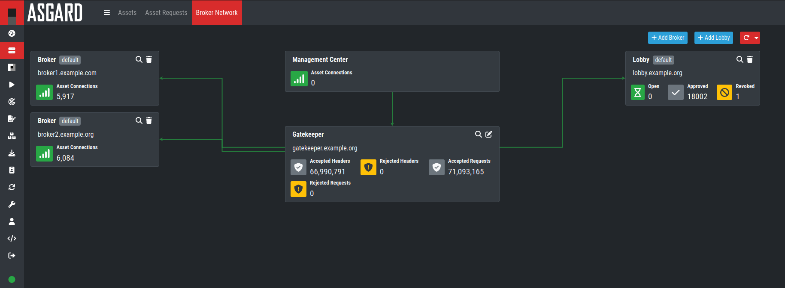

Before You Begin
================

Agent to ASGARD Communication
-----------------------------

There are a few things to consider before you start with the installation of you Broker Network. The communication between the ASGARD agent and the Broker Network is unidirectional. The ASGARD agent polls ASGARD, or one of the Brokers if configured, in a given timeframe and ask for tasks to execute. There is no active triggering from ASGARD or the Broker(s) to the ASGARD agent – we have designed it that way, because we believe that opening a port on all connected endpoints should and can be avoided. 

The Broker Network acts as a gateway between ASGARD Agents and ASGARD itself. This allows for more flexibility within your ASGARD environment, such as remote agents or a dedicated Broker in your DMZ.

If an ASGARD Agent is configured to work with your Broker Network, it can still connect directly to your ASGARD if the Broker can't be reached.

Overview of the Components
^^^^^^^^^^^^^^^^^^^^^^^^^^

There are three components which are needed for the Broker Network:

   * **Lobby** - New ASGARD Agents will get a certificate for a secure communication from the Lobby. An administrator can accept the agents or configure the auto-accept option. Certificates for agents can also be revoked here.
   * **Gatekeeper** - The Gatekeeper is used to communicate directly between all the components. Certificates and Revoke Lists get picked up from the Lobby and are being pushed to all Brokers.
   * **Broker** - Your Broker is the components which your ASGARD Agents directly communicate with. Once an ASGARD Agent received a valid certificate from the Lobby, communication is possible. You can have multiple Broker configured

Performance Considerations
--------------------------

In environments with up to 500 endpoints, the default polling interval is 20 seconds. In larger environments the polling interval increases automatically up to one minute for 2.000 endpoints and 10 minutes for a configuration with 25.000 endpoints connected to a single ASGARD. 

Obviously, large environments are not as responsive as small environments when it comes to opening remote shells or executing urgent response tasks. It may take up to 10 minutes for the shell to open or the result to show up. However, once open, the shell or the response tasks are very responsive – almost as if it is native on the system.

In order to adapt to specific requirements regarding responsiveness, the polling behavior can be modified. For details, refer to <HERE LINK TO CHAPTER>. The hardware requirements in the next chapter assume that the default polling interval is used. 

Using a Proxy between ASGARD Agent and ASGARD
---------------------------------------------

ASGARD supports using a standard http proxy for the entire Agent to ASGARD communication. In order to use a proxy, the ASGARD agent must be repacked after installation. For details, see <HERE LINK TO CHAPTER>.

Hardware Requirements
---------------------

ASGARDs hardware requirements depend on the number of connected endpoints and also on the intended use. For example, you should consider using bigger hard disks if you are planning to use Bifrost or ASGARD's evidence collection feature extensively.

.. list-table::
   :header-rows: 1
   :widths: 30, 70

   * - Connected Endpoints
     - Minimum  Hardware Requirements
   * - FILL
     - FILL
   * - FILL
     - FILL
   * - FILL
     - FILL

Network Requirements
--------------------

The ASGARD components use the following ports.

ASGARD Agent
^^^^^^^^^^^^

.. list-table:: 
   :header-rows: 1
   :widths: 30, 20, 25, 25

   * - Description
     - Port
     - Source
     - Destination
   * - Agent / Server communication
     - 443/tcp
     - ASGARD Agent
     - Broker / ASGARD
   * - Retrieve certificate
     - 443/tcp
     - ASGARD Agent
     - Lobby

.. note::
    The Lobby should not be exposed on the open internet. You can deploy your Lobby in your internal network and let all the agents pick up a certificate once they are being installed.
    The communication between Agents and the Lobby is a happening once, so that the Agents can get their key material for the secure channel.

Gatekeeper
^^^^^^^^^^

.. list-table::
   :header-rows: 1
   :widths: 30, 20, 25, 25

   * - Description
     - Port
     - Source
     - Destination
   * - Statistics
 
       pull CC [1]_ and CRL [2]_
     - 12000/tcp
     - Gatekeeper
     - Lobby
   * - Statistics

       push CC [1]_ and CRL [2]_
     - 12000/tcp
     - Gatekeeper
     - Broker
   * - Create secure tunnel per client
     - 12001-1200x/tcp
 
       (x = CPU count of Broker)
     - Gatekeeper
     - Broker

.. note:: 
    Your Gatekeeper is getting the current list of allowed and revoked certificates from the Lobby. Those certificates are in return sent to the all Brokers.

.. [1]
   Client Certificate

.. [2]
   Certificate Revocation List

ASGARD
^^^^^^

.. list-table:: 
   :header-rows: 1
   :widths: 30, 20, 25, 25

   * - Description
     - Port
     - Source
     - Destination
   * - Backend management of Gatekeeper, Broker and Lobby
 
       Agent communication
     - 12000/tcp
     - ASGARD
     - Gatekeeper

Management Workstation
^^^^^^^^^^^^^^^^^^^^^^

.. list-table:: 
   :header-rows: 1
   :widths: 30, 20, 25, 25

   * - Description
     - Port
     - Source
     - Destination
   * - CLI administration
     - 22/tcp
     - Workstation
     - Broker
   * - CLI administration
     - 22/tcp
     - Workstation
     - Gatekeeper
   * - Web administration
     - 9443/tcp
     - Workstation
     - Lobby
   * - CLI administration
     - 22/tcp
     - Workstation
     - Lobby

Internet
^^^^^^^^

The Broker Network components are configured to retrieve updates from the following remote system:

.. list-table:: 
   :header-rows: 1
   :widths: 25, 15, 25, 35

   * - Description
     - Port
     - Source
     - Destination
   * - Product and system updates
     - 443/tcp
     - Gatekeeper, Lobby, Broker
     - update3.nextron-systems.com
   * - NTP
     - 123/udp
     - Gatekeeper, Lobby, Broker
     - 0.debian.pool.ntp.org [3]_
   * - NTP
     - 123/udp
     - Gatekeeper, Lobby, Broker
     - 1.debian.pool.ntp.org [3]_
   * - NTP
     - 123/udp
     - Gatekeeper, Lobby, Broker
     - 2.debian.pool.ntp.org [3]_

.. [3]
  The NTP server configuration can be changed.

All proxy systems should be configured to allow access to these URLs without TLS/SSL interception. (ASGARD uses client-side SSL certificates for authentication). It is possible to configure a proxy server, username and password during the setup process of the ASGARD platform. Only BASIC authentication is supported (no NTLM authentication support).

DNS
^^^

All the components need to have a resolvable FQDN.

Brokers facing the open internet need to be resolvable with a FQDN, so make sure to configer the necessary A-Records before setting up an external facing Broker.

Verify the Downloaded ISO (Optional)
------------------------------------

You can do a quick hash check to verify that the download was not corrupted.
We recommend to verify the downloaded ISO's signature as this is the cryptographically sound method.

The hash and signature file are both part of the ZIP archive you download from our `portal server <https://portal.nextron-systems.com>`__.

Via Hash
^^^^^^^^

Extract the ZIP and check the sha256 hash:

On Linux

.. code-block:: console

    user@host:~$ sha256sum -c nextron-universal-installer.iso.sha256
    nextron-universal-installer.iso: OK

or in Windows command prompt

.. code-block:: doscon

    C:\Users\user\Desktop\asgard2-installer>type nextron-universal-installer.iso.sha256
    efccb4df0a95aa8e562d42707cb5409b866bd5ae8071c4f05eec6a10778f354b  nextron-universal-installer.iso
    C:\Users\user\Desktop\asgard2-installer>certutil -hashfile nextron-universal-installer.iso SHA256
    SHA256 hash of nextron-universal-installer.iso:
    efccb4df0a95aa8e562d42707cb5409b866bd5ae8071c4f05eec6a10778f354b
    CertUtil: -hashfile command completed successfully.  

or in powerhsell

.. code-block:: ps1con

    PS C:\Users\user\Desktop\asgard2-installer>type .\nextron-universal-installer.iso.sha256
    efccb4df0a95aa8e562d42707cb5409b866bd5ae8071c4f05eec6a10778f354b  nextron-universal-installer.iso
    PS C:\Users\user\Desktop\asgard2-installer>Get-FileHash .\nextron-universal-installer.iso

    Algorithm       Hash                                                                   Path
    ---------       ----                                                                   ----
    SHA256          EFCCB4DF0A95AA8E562D42707CB5409B866BD5AE8071C4F05EEC6A10778F354B       C:\Users\user\Desktop\asgard2-installer\nextron-universal-installer.iso

Via Signature (Recommended)
^^^^^^^^^^^^^^^^^^^^^^^^^^^

Extract the ZIP, `download the public signature <https://www.nextron-systems.com/certificates-and-keys>`__ and verify the signed ISO:

On Linux

.. code-block:: console

    user@host:~$ wget https://www.nextron-systems.com/certs/codesign.pem
    user@host:~$ openssl dgst -sha256 -verify codesign.pem -signature nextron-universal-installer.iso.sig nextron-universal-installer.iso
    Verified OK

or in powershell

.. code-block:: ps1con

    PS C:\Users\user\Desktop\asgard2-installer>Invoke-WebRequest -Uri https://www.nextron-systems.com/certs/codesign.pem -OutFile codesign.pem
    PS C:\Users\user\Desktop\asgard2-installer>"C:\Program Files\OpenSSL-Win64\bin\openssl.exe" dgst -sha256 -verify codesign.pem -signature nextron-universal-installer.iso.sig nextron-universal-installer.iso
    Verified OK 

.. note::

    If ``openssl`` is not present on your system you can easily install it using winget: ``winget install openssl``.