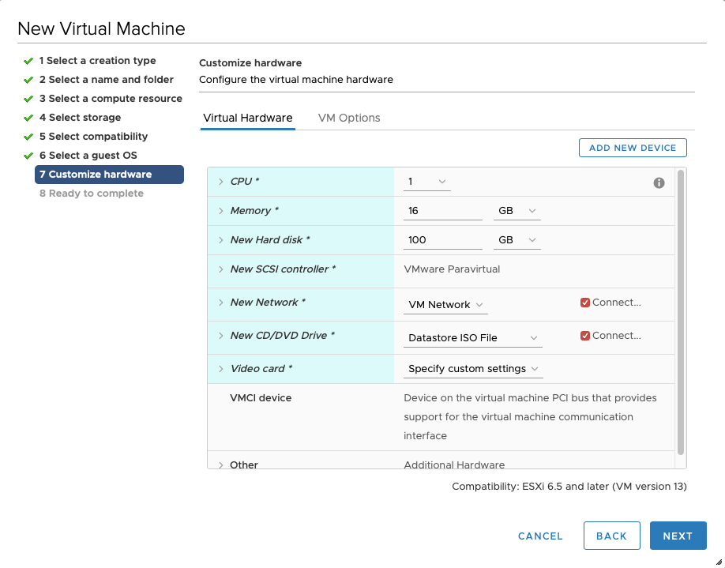
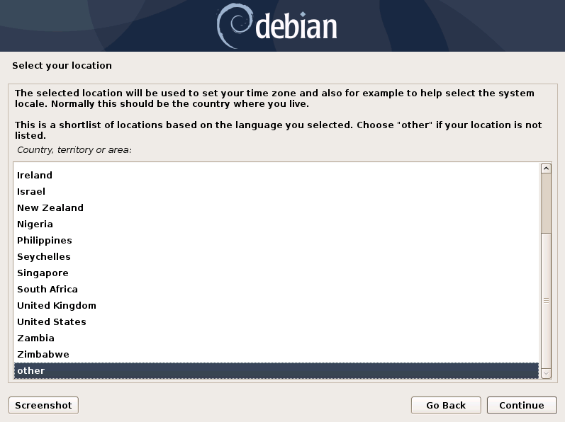
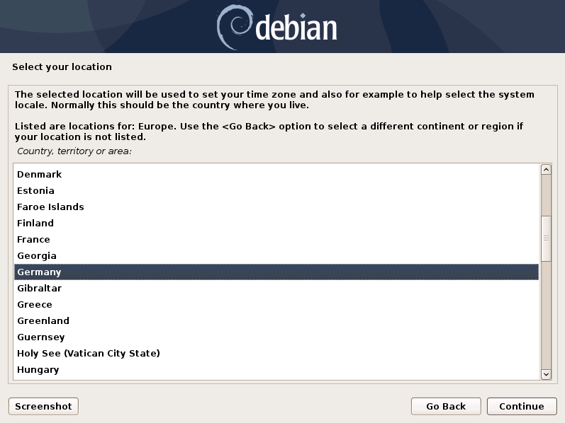
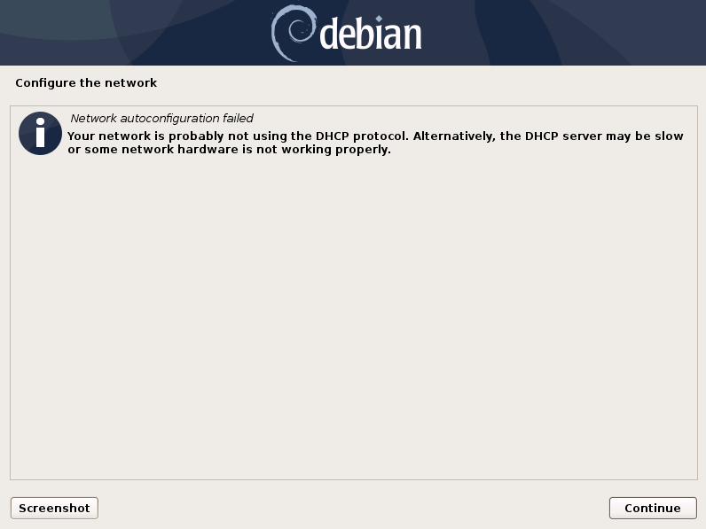
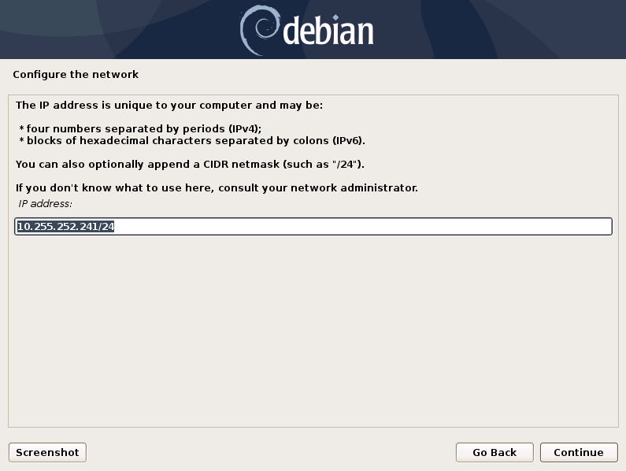

Setup Guide
===========

Overview of the Components
--------------------------

There are three components which are needed for the Broker Network:

   * **Lobby** - New ASGARD Agents will get a certificate for a secure communication from the Lobby. An administrator can accept the agents or configure the auto-accept option. Certificates for agents can also be revoked here.
   * **Gatekeeper** - The Gatekeeper is used to communicate directly between all the components. Certificates and Revoke Lists get picked up from the Lobby and are being pushed to all Brokers.
   * **Broker** - Your Broker is the components which your ASGARD Agents directly communicate with. Once an ASGARD Agent received a valid certificate from the Lobby, communication is possible. You can have multiple Broker configured

.. figure:: ../images/broker_network_overview.png
   :target: ../_images/broker_network_overview.png
   :alt: The Broker Network

Set up a New ESX VM and Mount the ISO
-------------------------------------

.. note::
   This step has to be done three times, we need one dedicated server for each component. Please see :ref:`usage/requirements:hardware requirements` for the hardware requirements.

Create a new VM with your virtualization software. In this case, we will use VMWare ESX managed through a VMWare VCenter.

The new VM must be configured with a Linux base system and Debian GNU/Linux 10 (64 bits) as target version. It is recommended to upload the ASGARD ISO to an accessible data store and mount the same to your newly created VM. 

.. figure:: ../images/setup_esx1.png
   :target: ../_images/setup_esx1.png
   :alt: New Virtual Machine - ESX

.. figure:: ../images/setup_esx2.png
   :target: ../_images/setup_esx2.png
   :alt: New Virtual Machine - ESX

.. figure:: ../images/setup_esx3.png
   :target: ../_images/setup_esx3.png
   :alt: New Virtual Machine - ESX

Please make sure to select a suitable v-switch or physical interface that reflects the IP address scheme you are planning to use for the new ASGARD.

Navigate through the installer
------------------------------

The installation Process is started by clicking on ASGARD Graphical install. The installer then loads the additional components from the ISO and lets you select location and language.

.. figure:: ../images/setup_iso_installer.png
   :target: ../_images/setup_iso_installer.png
   :alt: ISO Installer - ASGARD

.. figure:: ../images/setup_language.png
   :target: ../_images/setup_language.png
   :alt: Select a language

.. warning::
   Please make sure to select the correct Country, as this will also set your local timezone!

.. figure:: ../images/setup_locales.png
   :target: ../_images/setup_locales.png
   :alt: Configure locales

.. note::
   If DHCP is available, network parameters will be configured automatically. Without DHCP, ASGARD drops into the manual network configuration dialogue. The IP address can be change later, see :ref:`usage/setup:Change IP Address`

.. figure:: ../images/setup_network2.png
   :target: ../_images/setup_network2.png
   :alt: Configure the network

.. figure:: ../images/setup_network4.png
   :target: ../_images/setup_network4.png
   :alt: Configure the network

.. warning::
   ASGARD needs to be able to resolve internal and external IP addresses.

.. figure:: ../images/setup_network5.png
   :target: ../_images/setup_network5.png
   :alt: Configure the network

.. figure:: ../images/setup_network6.png
   :target: ../_images/setup_network6.png
   :alt: Configure the network

.. warning::
   **Important:** Make sure that the combination of hostname and domain creates an FQDN that can be resolved from the endsystems on which you intend to install the ASGARD agents. If you've configured a FQDN (hostname + domain) that cannot be resolved on the clients, no agent will be able to find and reconnect to the ASGARD server. 

.. figure:: ../images/setup_network7.png
   :target: ../_images/setup_network7.png
   :alt: Configure the network

.. figure:: ../images/setup_password.png
   :target: ../_images/setup_password.png
   :alt: Set up users and passwords

.. figure:: ../images/setup_disks1.png
   :target: ../_images/setup_disks1.png
   :alt: Partition disks

Finally, write your configuration to the disk by selecting "Yes" and clicking "Continue".

.. figure:: ../images/setup_disks2.png
   :target: ../_images/setup_disks2.png
   :alt: Partition disks

If you are using a proxy to access the internet, enter the proxy details in the next step. Please note, **Internet connectivity is required** for the next step – the installation of the ASGARD service. 

.. figure:: ../images/setup_proxy.png
   :target: ../_images/setup_proxy.png
   :alt: Finish the installation

The base installation is now complete. In the next step we will install the Broker Network Components. For this step **Internet connectivity is required**.

Use SSH to connect to the appliance using the user ``nextron`` and the password you specified during the installation. If SSH is not available, you can perform the next steps via the Console of your Virtualization Host, though SSH has more possibilities.

Installing the Broker Network Components
----------------------------------------

Installation of the Components
^^^^^^^^^^^^^^^^^^^^^^^^^^^^^^

After the base installation of your servers is completed, we can install the specific software for the components.

You can now choose the role you want to install (Broker, Gatekeeper or Lobby):

.. figure:: ../images/broker_nextronInstaller.png
   :target: ../_images/broker_nextronInstaller.png
   :alt: the nextronInstaller

You can install the three servers in any order, as we will configure them once they are all up and running.

.. warning::
   The Broker Network needs a minimum version of 2.14.0 of the ASGARD Management Center. You also need the new/updated ISO installer image.

Gatekeeper
^^^^^^^^^^

To install the Gatekeeper, run the following command on your newly installed system:

.. code-block:: console
    
    nextron@gatekeeper:~$ sudo nextronInstaller -gatekeeper

.. figure:: ../images/setup_gatekeeper1.png
   :target: ../_images/setup_gatekeeper1.png
   :alt: Installing the Gatekeeper

After the installation is done, you will see the following message:

.. figure:: ../images/setup_gatekeeper2.png
   :target: ../_images/setup_gatekeeper2.png
   :alt: Installing the Gatekeeper

You can now check if the service was installed successfully. 

.. code-block:: console
   
   nextron@gatekeeper:~$ systemctl status asgard2-gatekeeper.service
   
You will see that the service is in a "**failed/exited**" state. This will change once we configured our ASGARD with the Gatekeeper.

To configure your Gatekeeper in the ASGARD Management Center, please see the :ref:`usage/administration:Gatekeeper` Chapter.

Lobby
^^^^^

To install the Lobby, run the following command on your newly installed system:

.. code-block:: console
   
   nextron@lobby:~$ sudo nextronInstaller -lobby

.. figure:: ../images/setup_lobby1.png
   :target: ../_images/setup_lobby1.png
   :alt: Installing the Lobby

After the installation is finished, you will see the following message:

.. figure:: ../images/setup_lobby2.png
   :target: ../_images/setup_lobby2.png
   :alt: Installing the Lobby

You can check the service to see if everything is up and running.

.. code-block:: console
   
   nextron@lobby:~$ systemctl status asgard-lobby.service

.. figure:: ../images/setup_lobby3.png
   :target: ../_images/setup_lobby3.png
   :alt: Installing the Lobby

You can now navigate to the web interface of the lobby :samp:`https://<FQDN>:9443`. Please log into the Lobby with the credentials of the user ``nextron``:

.. figure:: ../images/setup_lobby4.png
   :target: ../_images/setup_lobby4.png
   :alt: Using the Lobby

For the next steps, we need to set a secure password for the ``nextron`` user. This user will be only used to manage users on the Lobbies web interface. After changing the password, we need to create an administrative user. Changing the ``nextron`` users web password will not change the SSH password of the user!

After changing the password, you will be logged out of the Lobby. Log back into the Lobby. You are now able to see on the left navigation menu ``System Settings``. Go to the System Settings and add a new user. Make sure the new user has the ``Admin`` Role:

.. figure:: ../images/setup_lobby5.png
   :target: ../_images/setup_lobby5.png
   :alt: Using the Lobby

.. figure:: ../images/setup_lobby6.png
   :target: ../_images/setup_lobby6.png
   :alt: Using the Lobby

You can now log out of the Lobby and back in with the new admin user. You are now able to see on the left navigation menu ``Assets``. This will be used later on to accept new assets.

.. figure:: ../images/setup_lobby7.png
   :target: ../_images/setup_lobby7.png
   :alt: Using the Lobby

To configuration your Lobby in the ASGARD Management Center , please see the :ref:`usage/administration:Lobby` Chapter.

Broker
^^^^^^

To install a Broker, run the following command on your newly installed system

.. code-block:: console
   
   nextron@broker:~$ sudo nextronInstaller -broker

.. figure:: ../images/setup_broker1.png
   :target: ../_images/setup_broker1.png
   :alt: Installing a Broker

After the installation is finished, you will see the following message:

.. figure:: ../images/setup_broker2.png
   :target: ../_images/setup_broker2.png
   :alt: Installing a Broker

You can now check if the service was installed successfully.

.. code-block:: console
   
   nextron@broker:~$ systemctl status asgard-broker.service

You will see that the service is in a "**failed/exited**" state. This will change once we configured our ASGARD with the Broker.

To configure your Broker in the ASGARD Management Center, please see the :ref:`usage/administration:Broker` Chapter.

Change IP Address
-----------------

ASGARD's IP can be changed in **/etc/network/interfaces**. The IP is configured with the address variable.

.. code-block:: console

   nextron@asgard:~$ sudo vi /etc/network/interfaces

.. code-block::

   auto ens32
   iface ens32 inet static
   address 192.0.2.7
   netmask 255.255.255.0
   gateway 192.0.2.254

.. note::
   There might be a case where the name of the network interface (in this example: ``ens32``) is different.
   To verify this you can run ``ip a`` and see the name of the network interface.

The new IP can be applied with the command ``sudo systemctl restart networking``.
